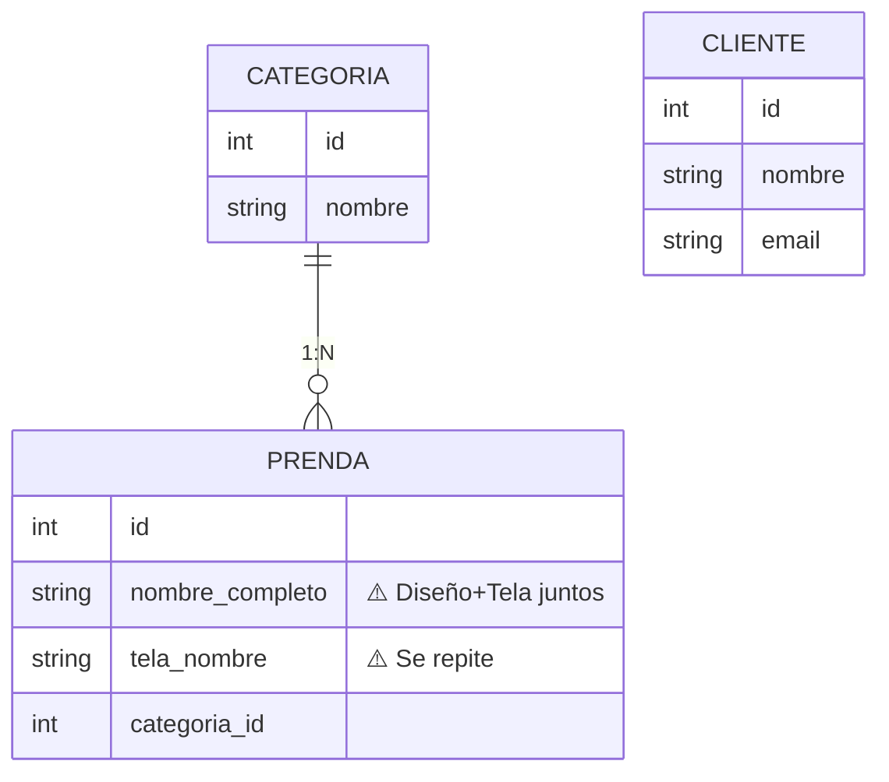
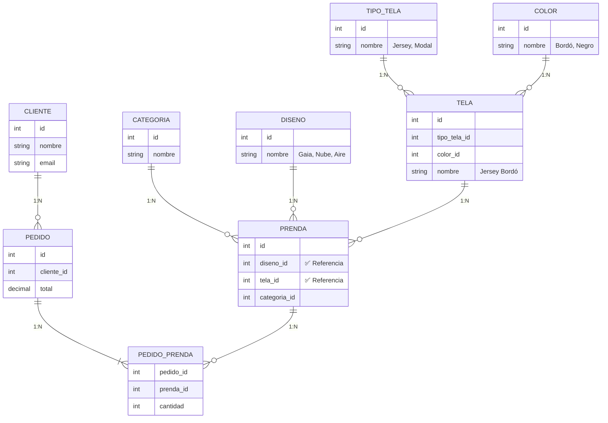

# Comparación: Fase 0 vs Fase 1

## Evolución del Sistema CHAMANA

**Visualización de la Progresión de Normalización**

---

## 📊 Fase 0: Sistema Inicial (Pre-normalizado)

### 3 Tablas - 1 Relación



### ⚠️ Problemas Identificados

1. **`nombre_completo`** = "Gaia - Jersey Bordó"
   - Combina diseño + tela (no atómico)
2. **`tela_nombre`** = "Jersey Bordó"
   - Se repite en múltiples prendas (redundante)
3. **Sin sistema de ventas**
   - Clientes sin relación con prendas

---

## ✅ Fase 1: Sistema Normalizado (3NF)

### 9 Tablas - 8 Relaciones



### ✅ Mejoras Logradas

1. **Diseño separado**
   - Tabla `disenos` independiente
   - Sin duplicación de nombres
2. **Tela normalizada**
   - Tabla `telas` con composición (tipo + color)
   - Tablas `tipo_telas` y `colores` separadas
3. **Sistema de ventas completo**
   - Clientes realizan pedidos
   - Pedidos contienen múltiples prendas

---

## 📈 Resumen de Cambios

| Métrica                    | Fase 0 | Fase 1 | Cambio |
| -------------------------- | ------ | ------ | ------ |
| **Tablas**                 | 3      | 9      | +6     |
| **Relaciones**             | 1      | 8      | +7     |
| **Forma Normal**           | ~1NF   | 3NF    | ✅     |
| **Redundancia**            | Alta   | Nula   | ✅     |
| **Tabla Intermedia (N:M)** | 0      | 1      | ✅     |
| **Sistema de Ventas**      | ❌     | ✅     | ✅     |

---

## 🔄 Transformación de Datos

### Ejemplo de Normalización

#### Antes (Fase 0):

```sql
-- Tabla prendas
id | nombre_completo        | tela_nombre    | categoria_id
---|-----------------------|----------------|-------------
1  | Gaia - Jersey Bordó   | Jersey Bordó   | 1
2  | Gaia - Modal Negro    | Modal Negro    | 1
3  | Nube - Jersey Bordó   | Jersey Bordó   | 2
```

**Problema**: "Jersey Bordó" se repite 2 veces

---

#### Después (Fase 1):

```sql
-- Tabla disenos
id | nombre
---|-------
1  | Gaia
2  | Nube

-- Tabla tipo_telas
id | nombre
---|-------
1  | Jersey
2  | Modal

-- Tabla colores
id | nombre
---|-------
1  | Bordó
2  | Negro

-- Tabla telas
id | nombre_completo | tipo_tela_id | color_id
---|-----------------|--------------|----------
1  | Jersey Bordó    | 1            | 1
2  | Modal Negro     | 2            | 2

-- Tabla prendas
id | diseno_id | tela_id | categoria_id
---|-----------|---------|-------------
1  | 1         | 1       | 1
2  | 1         | 2       | 1
3  | 2         | 1       | 2
```

**Solución**: ✅ Cada valor aparece una sola vez

---

## 🎯 Beneficios de la Normalización

### Performance

- ✅ Menos datos duplicados
- ✅ Updates más rápidos (un solo lugar)
- ✅ Menor espacio de almacenamiento

### Integridad

- ✅ Sin inconsistencias
- ✅ Validación por claves foráneas
- ✅ Datos atómicos

### Mantenibilidad

- ✅ Fácil agregar nuevos diseños
- ✅ Fácil agregar nuevas telas/colores
- ✅ Sistema escalable

### Funcionalidad

- ✅ Sistema de pedidos completo
- ✅ Relación N:M entre pedidos y prendas
- ✅ Historial de compras por cliente

---

**Evolución**: Pre-normalizado → 3NF  
**Tiempo estimado de migración**: Fase 1  
**Impacto**: Alto valor de aprendizaje
