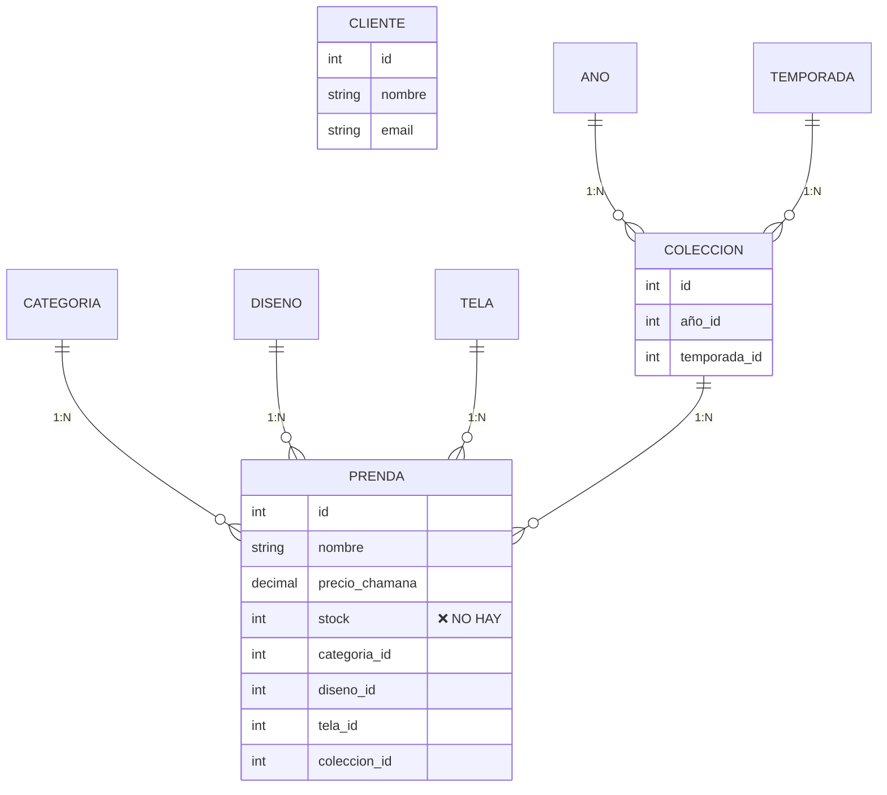
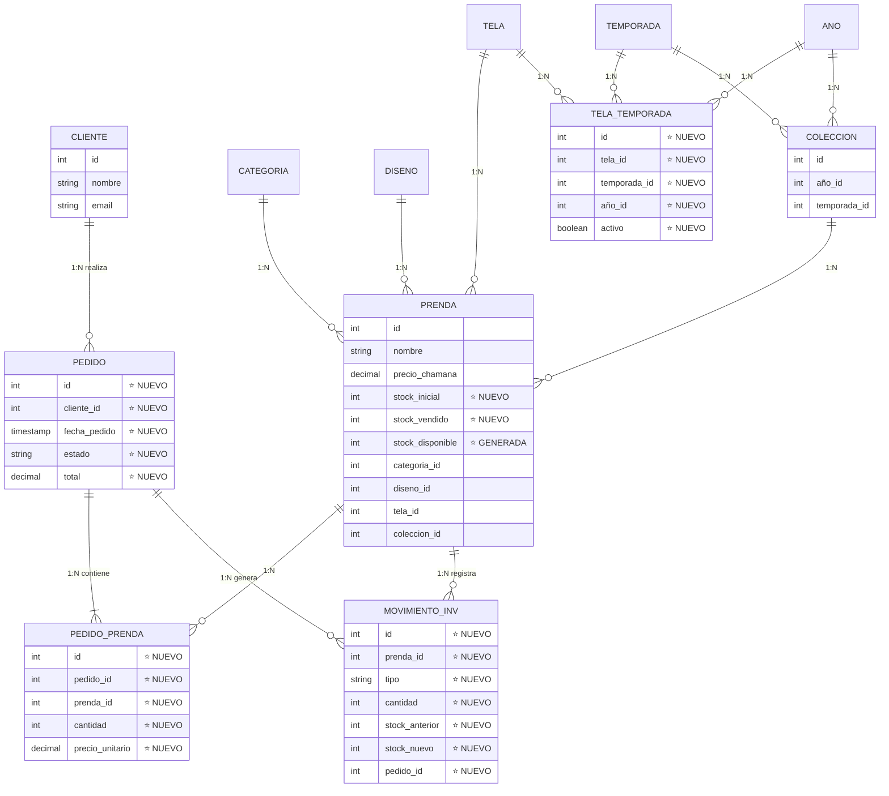

# Comparación: Fase 1 (1NF) vs Fase 2 (2NF)

## Evolución del Sistema CHAMANA

**Visualización de la Progresión de Normalización**

---

## 📊 Fase 1: Sistema Normalizado (1NF)

### 9 Tablas - Solo Catálogo



### ⚠️ Limitaciones Identificadas

1. **Sin sistema de órdenes**
   - Clientes existen pero no compran
2. **Sin gestión de inventario**
   - No hay control de stock
3. **Sin historial de ventas**
   - No se registran transacciones
4. **Telas estáticas**
   - No hay disponibilidad por temporada

---

## ✅ Fase 2: E-commerce Completo (2NF)

### 12 Tablas - Sistema Funcional



### ✅ Mejoras Logradas

1. **Sistema de órdenes completo**
   - Tabla `pedidos` con estados (pendiente, completado, cancelado)
   - Tabla `pedidos_prendas` (junction table) con cantidades y precios históricos
2. **Gestión de inventario automática**
   - `stock_inicial`, `stock_vendido`, `stock_disponible` (generada)
   - Columna generada garantiza consistencia
3. **Auditoría completa**
   - Tabla `movimientos_inventario` registra todos los cambios
   - Trazabilidad con pedidos
4. **Telas estacionales**
   - Tabla `telas_temporadas` (junction table)
   - Disponibilidad por temporada y año

---

## 📈 Resumen de Cambios

| Métrica                    | Fase 1 (1NF) | Fase 2 (2NF) | Cambio |
| -------------------------- | ------------ | ------------ | ------ |
| **Tablas**                 | 9            | 12           | **+3** |
| **Relaciones**             | 8            | 15           | **+7** |
| **Forma Normal**           | 1NF          | 2NF          | ✅     |
| **Dependencias Parciales** | N/A          | Eliminadas   | ✅     |
| **Junction Tables**        | 0            | 2            | **+2** |
| **Sistema de Órdenes**     | ❌           | ✅           | ✅     |
| **Gestión de Inventario**  | ❌           | ✅           | ✅     |
| **Auditoría de Stock**     | ❌           | ✅           | ✅     |
| **Telas Estacionales**     | ❌           | ✅           | ✅     |

---

## 🔄 Transformación de Datos

### Ejemplo 1: Nueva Funcionalidad - Sistema de Pedidos

#### Antes (Fase 1):

```sql
-- ❌ NO DISPONIBLE
-- No hay tabla de pedidos ni sistema de órdenes
```

#### Después (Fase 2):

```sql
-- ✅ Sistema completo de órdenes

-- Tabla pedidos
INSERT INTO pedidos (cliente_id, fecha_pedido, estado, subtotal, total)
VALUES (5, NOW(), 'pendiente', 15900.00, 15900.00);

-- Tabla pedidos_prendas (junction table - 2NF)
INSERT INTO pedidos_prendas (pedido_id, prenda_id, cantidad, precio_unitario, subtotal)
VALUES (1, 10, 2, 7950.00, 15900.00);

-- Tabla movimientos_inventario (auditoría)
INSERT INTO movimientos_inventario (prenda_id, tipo, cantidad, stock_anterior, stock_nuevo, pedido_id, motivo)
VALUES (10, 'venta', 2, 10, 8, 1, 'Venta por pedido #1');
```

---

### Ejemplo 2: Gestión de Inventario

#### Antes (Fase 1):

```sql
-- Tabla prendas (sin control de stock)
id | nombre            | precio_chamana
---|--------------------|---------------
10 | Prenda Ejemplo    | 7950.00
-- ❌ No hay campo de stock
```

#### Después (Fase 2):

```sql
-- Tabla prendas (con gestión automática)
id | nombre            | precio_chamana | stock_inicial | stock_vendido | stock_disponible
---|-------------------|----------------|---------------|---------------|------------------
10 | Prenda Ejemplo    | 7950.00        | 10            | 2             | 8 (GENERADA)
-- ✅ stock_disponible = stock_inicial - stock_vendido (calculada automáticamente)
```

---

### Ejemplo 3: Telas Estacionales

#### Antes (Fase 1):

```sql
-- Telas genéricas sin temporalidad
id | nombre        | tipo
---|---------------|-------
1  | Jersey Bordó  | Jersey
2  | Modal Negro   | Modal
-- ❌ No hay información de cuándo usar cada tela
```

#### Después (Fase 2):

```sql
-- Telas con disponibilidad por temporada (junction table - 2NF)

-- Tabla telas_temporadas
tela_id | temporada_id | año_id | activo | fecha_registro
--------|--------------|--------|--------|----------------
1       | 2 (Invierno) | 5 (2025) | true   | 2025-10-22
2       | 1 (Verano)   | 5 (2025) | true   | 2025-10-22

-- ✅ Ahora sabemos que Jersey Bordó es para Invierno 2025
-- ✅ Modal Negro es para Verano 2025
```

---

## 🎯 Beneficios de la Normalización 2NF

### Performance

- ✅ Datos no duplicados (pedido completo en tabla `pedidos`)
- ✅ Líneas de pedido en tabla separada (junction table)
- ✅ 34 índices optimizan JOINs

### Integridad

- ✅ Sin inconsistencias (columnas generadas)
- ✅ Validación por claves foráneas (14 FKs)
- ✅ Junction tables eliminan dependencias parciales

### Mantenibilidad

- ✅ Fácil agregar nuevos pedidos
- ✅ Fácil agregar items a pedidos
- ✅ Auditoría automática de inventario

### Funcionalidad

- ✅ Sistema de órdenes completo
- ✅ Gestión de inventario automática
- ✅ Trazabilidad completa de ventas
- ✅ Telas estacionales

---

## ✅ Cumplimiento de 2NF

### Criterios de Segunda Forma Normal

1. **✅ Está en 1NF**: Todas las tablas tienen claves primarias y valores atómicos
2. **✅ No hay dependencias parciales**: Todos los atributos no-clave dependen de la clave primaria completa

### Ejemplo de 2NF: Tabla `pedidos_prendas` (Junction Table)

**Antes (hipotético problemático)**:

```
pedidos (id, cliente_id, prenda_id, cantidad, precio_unitario, total_pedido)
                          └──────────────────┘            └────────┘
                          Dependen solo de prenda_id     Depende de todo el pedido
                          ❌ Dependencia parcial!
```

**Después (2NF correcto)**:

```
pedidos (id, cliente_id, total_pedido)         ✅ Todos dependen de id
pedidos_prendas (id, pedido_id, prenda_id, cantidad, precio_unitario, subtotal)
                                             ✅ Todos dependen de (pedido_id, prenda_id)
```

---

## 📊 Nuevas Capacidades de Negocio

### Antes (Fase 1): Solo Catálogo

```
┌─────────────────────────────────────┐
│ Fase 1: CATÁLOGO DE PRODUCTOS      │
├─────────────────────────────────────┤
│ ✅ Gestionar clientes               │
│ ✅ Gestionar prendas                │
│ ✅ Organizar por temporadas         │
│ ✅ Colecciones de moda              │
│                                     │
│ ❌ No hay sistema de órdenes        │
│ ❌ No hay control de inventario     │
│ ❌ No hay trazabilidad de ventas    │
│ ❌ No hay reportes de ventas        │
└─────────────────────────────────────┘
```

### Después (Fase 2): E-commerce Completo

```
┌─────────────────────────────────────┐
│ Fase 2: E-COMMERCE FUNCIONAL       │
├─────────────────────────────────────┤
│ ✅ Gestionar clientes               │
│ ✅ Gestionar prendas                │
│ ✅ Organizar por temporadas         │
│ ✅ Colecciones de moda              │
│                                     │
│ ✅ Sistema de órdenes COMPLETO ⭐   │
│ ✅ Control de inventario AUTO ⭐    │
│ ✅ Trazabilidad total ⭐            │
│ ✅ Reportes de ventas ⭐            │
│ ✅ Telas estacionales ⭐            │
│ ✅ Auditoría de stock ⭐            │
└─────────────────────────────────────┘
```

---

**Evolución**: 1NF → 2NF  
**Tiempo estimado de migración**: Fase 2  
**Impacto**: Sistema completo funcional  
**Dato**: 100% de datos migrados sin pérdida
