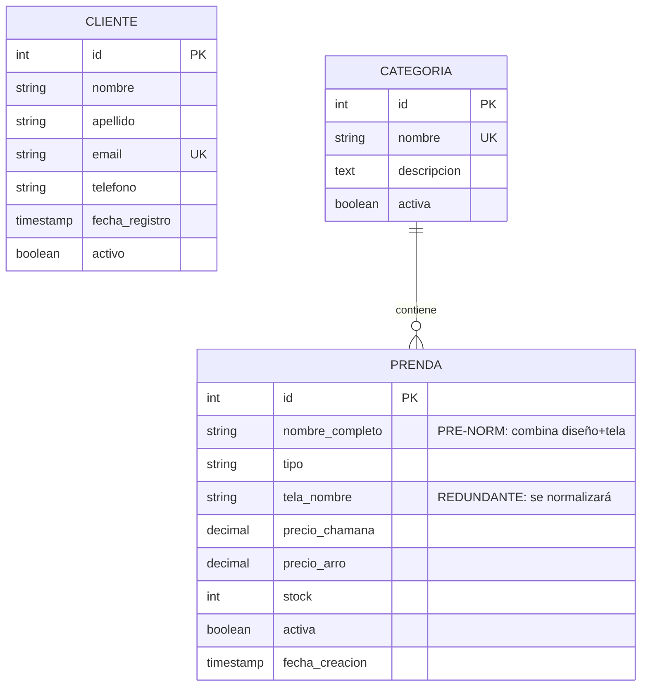

# MER - Modelo Entidad-Relación (Conceptual)

## Fase 0: Pre-Normalizado

**CHAMANA E-commerce - Línea Base Inicial**

---

## Sistema Actual: 3 Entidades Base

---

## Descripción

### 👥 CLIENTE

- Información básica de clientes CHAMANA
- **Sin relaciones** en esta fase
- Estructura simplificada (solo contacto)

### 📁 CATEGORIA

- Clasificación de prendas por tipo
- Ejemplos: Buzo, Remera, Vestido, Palazzo, Pantalón
- **Una categoría → muchas prendas**

### 👗 PRENDA

- Catálogo de ropa femenina
- Ejemplos: "Gaia - Jersey Bordó", "Nube - Modal Negro"
- ⚠️ **Pre-normalizado**: nombre_completo combina diseño + tela

---

## Estadísticas

| Entidad   | Registros |
| --------- | --------- |
| CLIENTE   | 20        |
| CATEGORIA | 5         |
| PRENDA    | 31        |

---

**Versión**: 0.1.0  
**Estado**: Pre-normalizado (intencional para aprendizaje)  
**Próxima fase**: Normalización a 1NF
