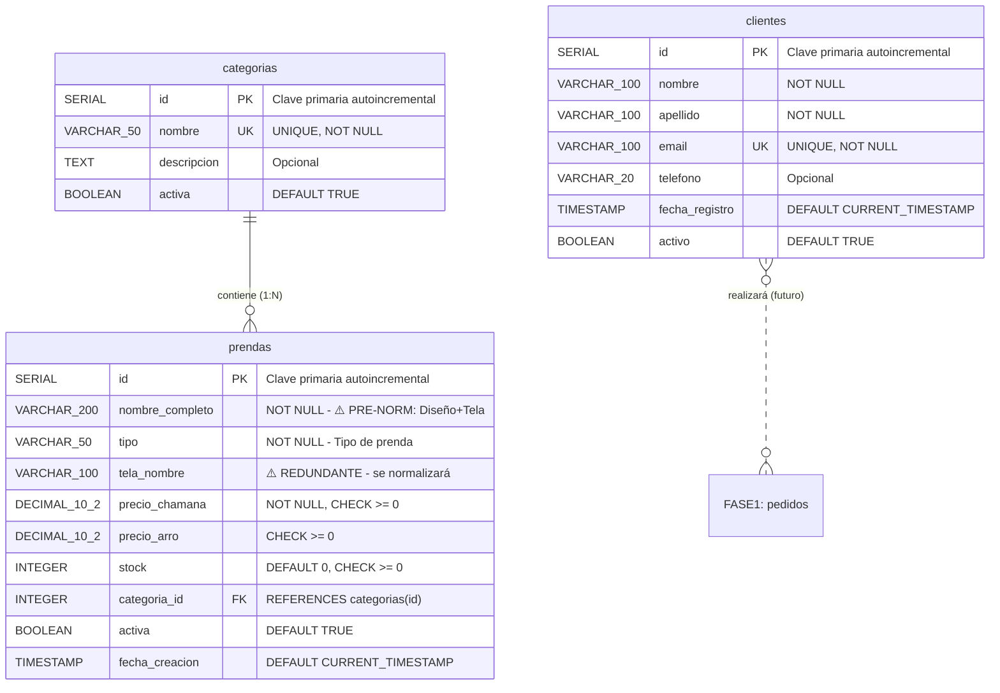

# DER - Diagrama Entidad-Relación (Lógico)

## Fase 0: Pre-Normalizado

**CHAMANA E-commerce - Especificación Técnica**

---

## Sistema Actual: 3 Tablas



---

## Especificaciones Técnicas

### Tabla: `clientes`

- **Propósito**: Información de comunicación básica
- **7 columnas** (simplificado)
- **Índices**: email (UNIQUE), activo

### Tabla: `categorias`

- **Propósito**: Clasificar prendas
- **4 columnas**
- **Valores**: Buzo (12 prendas), Remera (4), Vestido (1), Palazzo (8), Pantalón (4)

### Tabla: `prendas`

- **Propósito**: Catálogo de productos
- **10 columnas**
- **⚠️ Pre-normalizado**: nombre_completo combina múltiples valores
- **Índices**: categoria_id, tipo, activa

---

## Relación

### categorias → prendas (1:N)

- **Clave Foránea**: `prendas.categoria_id` → `categorias.id`
- **Cardinalidad**: Una categoría puede tener 0 o muchas prendas
- **Restricción**: Una prenda debe pertenecer a exactamente una categoría

---

## Restricciones de Integridad

```sql
-- CHECK Constraints
CHECK (precio_chamana >= 0)
CHECK (precio_arro >= 0)
CHECK (stock >= 0)

-- UNIQUE Constraints
UNIQUE (email) -- en clientes
UNIQUE (nombre) -- en categorias

-- DEFAULT Values
fecha_registro: CURRENT_TIMESTAMP
activo/activa: TRUE
stock: 0
```

---

**Base de Datos**: `chamana_db_fase0`  
**PostgreSQL**: 12+  
**Forma Normal**: ~1NF (parcial)  
**Estado**: Intencional para Fase 0 (aprendizaje)
