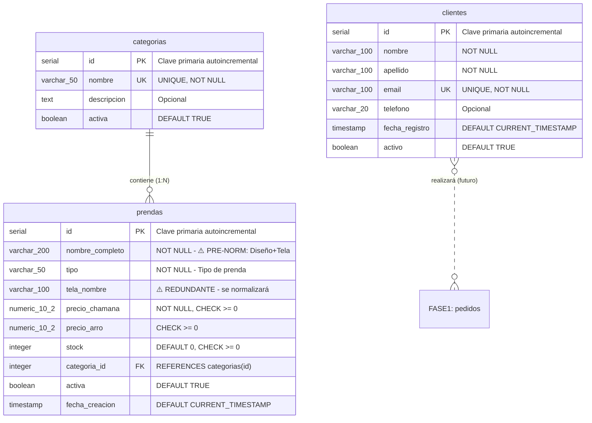

# ERD - Entity-Relationship Diagram (Físico/Técnico)

## Fase 0: Pre-Normalizado

**CHAMANA E-commerce - Modelo Físico PostgreSQL**

---

## Diagrama Entidad-Relación



---

## Especificaciones Técnicas por Tabla

### Tabla: `categorias`

**Schema**: `public`  
**Propósito**: Clasificar prendas por tipo

| Columna       | Tipo          | Restricciones    | Descripción                    |
| ------------- | ------------- | ---------------- | ------------------------------ |
| `id`          | `SERIAL`      | PRIMARY KEY      | Clave primaria autoincremental |
| `nombre`      | `VARCHAR(50)` | UNIQUE, NOT NULL | Nombre de la categoría         |
| `descripcion` | `TEXT`        | Opcional         | Descripción detallada          |
| `activa`      | `BOOLEAN`     | DEFAULT TRUE     | Estado activo/inactivo         |

**Índices**:

- PRIMARY KEY: `id`
- UNIQUE: `nombre`

**Valores de ejemplo**: Buzo, Remera, Vestido, Palazzo, Pantalón

---

### Tabla: `clientes`

**Schema**: `public`  
**Propósito**: Información de comunicación básica de clientes

| Columna          | Tipo           | Restricciones             | Descripción                    |
| ---------------- | -------------- | ------------------------- | ------------------------------ |
| `id`             | `SERIAL`       | PRIMARY KEY               | Clave primaria autoincremental |
| `nombre`         | `VARCHAR(100)` | NOT NULL                  | Nombre del cliente             |
| `apellido`       | `VARCHAR(100)` | NOT NULL                  | Apellido del cliente           |
| `email`          | `VARCHAR(100)` | UNIQUE, NOT NULL          | Email único del cliente        |
| `telefono`       | `VARCHAR(20)`  | Opcional                  | Teléfono de contacto           |
| `fecha_registro` | `TIMESTAMP`    | DEFAULT CURRENT_TIMESTAMP | Fecha de registro              |
| `activo`         | `BOOLEAN`      | DEFAULT TRUE              | Estado activo/inactivo         |

**Índices**:

- PRIMARY KEY: `id`
- UNIQUE: `email`
- INDEX: `activo` (para consultas de clientes activos)

---

### Tabla: `prendas`

**Schema**: `public`  
**Propósito**: Catálogo de productos (prendas de ropa)

| Columna           | Tipo            | Restricciones             | Descripción                              |
| ----------------- | --------------- | ------------------------- | ---------------------------------------- |
| `id`              | `SERIAL`        | PRIMARY KEY               | Clave primaria autoincremental           |
| `nombre_completo` | `VARCHAR(200)`  | NOT NULL                  | ⚠️ PRE-NORM: Combina Diseño+Tela         |
| `tipo`            | `VARCHAR(50)`   | NOT NULL                  | Tipo de prenda (ej: Buzo, Remera, etc.)  |
| `tela_nombre`     | `VARCHAR(100)`  | -                         | ⚠️ REDUNDANTE - se normalizará en Fase 1 |
| `precio_chamana`  | `NUMERIC(10,2)` | NOT NULL, CHECK >= 0      | Precio de venta CHAMANA                  |
| `precio_arro`     | `NUMERIC(10,2)` | CHECK >= 0                | Precio de venta Arro (opcional)          |
| `stock`           | `INTEGER`       | DEFAULT 0, CHECK >= 0     | Cantidad disponible en inventario        |
| `categoria_id`    | `INTEGER`       | FOREIGN KEY               | Referencia a categorias(id)              |
| `activa`          | `BOOLEAN`       | DEFAULT TRUE              | Estado activo/inactivo                   |
| `fecha_creacion`  | `TIMESTAMP`     | DEFAULT CURRENT_TIMESTAMP | Fecha de creación del registro           |

**Índices**:

- PRIMARY KEY: `id`
- FOREIGN KEY: `categoria_id` → `categorias(id)`
- INDEX: `tipo` (para búsquedas por tipo)
- INDEX: `activa` (para filtrar prendas activas)

**⚠️ Notas de Normalización**:

- `nombre_completo`: Combina múltiples valores (diseño + tela). Se normalizará en Fase 1.
- `tela_nombre`: Redundante, será extraído a tabla separada en Fase 1.

---

## Relaciones

### categorias → prendas (1:N)

**Tipo**: Uno a Muchos  
**Cardinalidad**: Una categoría puede contener 0 o muchas prendas

- **Clave Foránea**: `prendas.categoria_id` → `categorias.id`
- **Restricción**: Una prenda debe pertenecer a exactamente una categoría
- **Integridad Referencial**: ON DELETE RESTRICT (no se puede eliminar categoría con prendas)

**Representación Visual**:

```
categorias (1) ||--o{ (N) prendas
```

---

### clientes → pedidos (1:N) - Futuro

**Tipo**: Uno a Muchos (conceptual, Fase 1+)  
**Cardinalidad**: Un cliente puede realizar 0 o muchos pedidos

- **Estado**: Relación planificada para Fase 1
- **Representación**: Línea punteada (relación futura)

**Representación Visual**:

```
clientes (1) }o..o{ (N) FASE1: pedidos
```

---

## Restricciones de Integridad

### CHECK Constraints

```sql
-- Precios no negativos
CHECK (precio_chamana >= 0)
CHECK (precio_arro >= 0)

-- Stock no negativo
CHECK (stock >= 0)
```

### UNIQUE Constraints

```sql
-- Email único por cliente
UNIQUE (email) -- en tabla clientes

-- Nombre único por categoría
UNIQUE (nombre) -- en tabla categorias
```

### DEFAULT Values

```sql
-- Valores por defecto
fecha_registro: CURRENT_TIMESTAMP
fecha_creacion: CURRENT_TIMESTAMP
activo/activa: TRUE
stock: 0
```

### FOREIGN KEY Constraints

```sql
-- Relación categorias → prendas
FOREIGN KEY (categoria_id)
  REFERENCES categorias(id)
  ON DELETE RESTRICT
```

---

## Estadísticas del Modelo

| Tabla        | Columnas | Índices | Relaciones  | Estado             |
| ------------ | -------- | ------- | ----------- | ------------------ |
| `categorias` | 4        | 2       | 1 (salida)  | ✅ Implementado    |
| `clientes`   | 7        | 2       | 0           | ✅ Implementado    |
| `prendas`    | 10       | 4       | 1 (entrada) | ⚠️ Pre-normalizado |

---

## Notas de Diseño

### ⚠️ Pre-Normalización Intencional

Este modelo está **intencionalmente pre-normalizado** para fines académicos:

1. **`nombre_completo`**: Combina diseño y tela en un solo campo

   - Ejemplo: "Gaia - Jersey Bordó"
   - **Problema**: Viola 1NF (valores atómicos)
   - **Solución Fase 1**: Separar en `diseños` y `telas`

2. **`tela_nombre`**: Redundancia de datos
   - **Problema**: Misma tela repetida en múltiples prendas
   - **Solución Fase 1**: Tabla `telas` separada con relación N:M

### Forma Normal Actual

- **Estado**: ~1NF (parcial)
- **Razón**: Valores compuestos en `nombre_completo` y redundancia en `tela_nombre`
- **Objetivo Fase 1**: Normalización completa a 1NF

---

**Base de Datos**: `chamana_db_fase0`  
**SGBD**: PostgreSQL 12+  
**Schema**: `public`  
**Forma Normal**: ~1NF (parcial, intencional)  
**Estado**: ✅ Implementado - Listo para normalización
