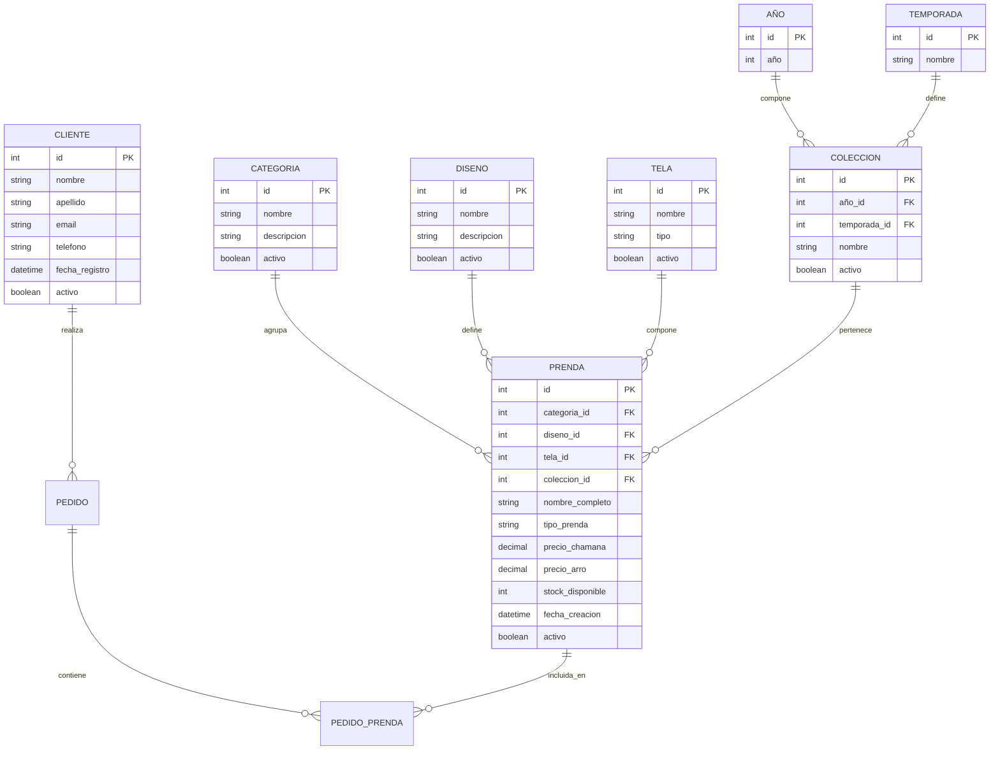

# MER - Modelo Entidad-Relación (Conceptual)

## Fase 1: Primera Forma Normal (1NF)

**CHAMANA E-commerce - Normalización Completa**

---

## Sistema Normalizado: 9 Entidades

---

## Descripción de Entidades

### 👥 CLIENTE

Información de clientes de CHAMANA con datos de contacto.

### 📁 CATEGORIA

Clasificación de prendas (Vestidos, Blusas, Pantalones).

### 🎨 DISENO ⭐ NUEVO (1NF)

Patrones de diseño extraídos de las prendas.

- **Justificación 1NF**: Elimina valores repetidos de diseño en la tabla de prendas.
- Ejemplos: "Marbella", "Valencia", "Gaia", "Nube"

### 🧵 TELA ⭐ NUEVO (1NF)

Tipos de tela normalizados.

- **Justificación 1NF**: Elimina valores repetidos de tipo_tela.
- Ejemplos: "Algodón Stretch", "Lino", "Jersey Bordó"

### 📅 AÑO ⭐ NUEVO (1NF)

Años disponibles para colecciones (2022-2032).

- **Justificación 1NF**: Datos atómicos para sistema de colecciones.

### 🌡️ TEMPORADA ⭐ NUEVO (1NF)

Temporadas del año (verano, invierno).

- **Justificación 1NF**: Datos atómicos para sistema de colecciones.

### 📦 COLECCION ⭐ NUEVO (1NF)

Colecciones estacionales (combinación de año + temporada).

- Ejemplos: "Verano 2025", "Invierno 2024"

### 👗 PRENDA (Modificada para 1NF)

Productos de CHAMANA con relaciones normalizadas.

- **Cambios desde Fase 0**: Ahora usa foreign keys en lugar de valores repetidos.

---

## Relaciones Principales

| Relación           | Cardinalidad | Descripción                           |
| ------------------ | ------------ | ------------------------------------- |
| CATEGORIA - PRENDA | 1:N          | Una categoría agrupa muchas prendas   |
| DISENO - PRENDA    | 1:N          | Un diseño se usa en muchas prendas    |
| TELA - PRENDA      | 1:N          | Una tela se usa en muchas prendas     |
| COLECCION - PRENDA | 1:N          | Una colección contiene muchas prendas |
| AÑO - COLECCION    | 1:N          | Un año tiene varias colecciones       |
| TEMPORADA - COLEC  | 1:N          | Una temporada se repite cada año      |

---

## Beneficios de 1NF

- ✅ Elimina valores repetidos (diseños, telas)
- ✅ Facilita búsquedas por diseño o tela
- ✅ Permite gestión de colecciones estacionales
- ✅ Reduce redundancia de datos
- ✅ Mejora integridad referencial

---

## Estadísticas

| Entidad   | Registros |
| --------- | --------- |
| CLIENTE   | 20        |
| CATEGORIA | 5         |
| DISENO    | ~15       |
| TELA      | ~10       |
| AÑO       | 11        |
| TEMPORADA | 2         |
| COLECCION | 22        |
| PRENDA    | 31        |

---

**Base de Datos**: `chamana_db_fase1`  
**Forma Normal**: 1NF (Primera Forma Normal)  
**Estado**: Valores atómicos, sin grupos repetidos  
**Próxima fase**: 2NF (Segunda Forma Normal)
