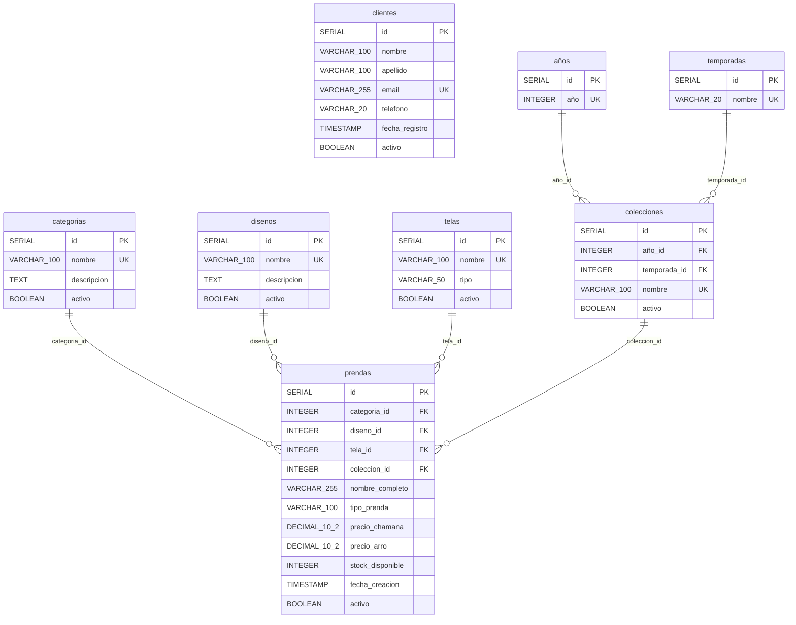

# DER - Diagrama Entidad-Relación (Lógico)

## Fase 1: Primera Forma Normal (1NF)

**CHAMANA E-commerce - Especificación Técnica Normalizada**

---

## Sistema Normalizado: 9 Tablas con Foreign Keys



---

## Especificaciones Técnicas

### Tabla: `disenos` ⭐ NUEVA (1NF)

- **Propósito**: Diseños de prendas normalizados
- **4 columnas**
- **Claves**: PK: `id`, UK: `nombre`
- **Justificación 1NF**: Extrae diseños repetidos de la tabla `prendas` a una entidad separada.

### Tabla: `telas` ⭐ NUEVA (1NF)

- **Propósito**: Tipos de tela normalizados
- **4 columnas**
- **Claves**: PK: `id`, UK: `nombre`
- **Justificación 1NF**: Normaliza el campo `tipo_tela` que se repetía en `prendas`.

### Tabla: `años` ⭐ NUEVA (1NF)

- **Propósito**: Años disponibles para colecciones (2022-2032)
- **2 columnas**
- **Datos**: 11 registros

### Tabla: `temporadas` ⭐ NUEVA (1NF)

- **Propósito**: Temporadas del año
- **2 columnas**
- **Datos**: 2 registros ('verano', 'invierno')

### Tabla: `colecciones` ⭐ NUEVA (1NF)

- **Propósito**: Colecciones estacionales (año + temporada)
- **5 columnas**
- **Claves**: PK: `id`, FK: `año_id`, `temporada_id`, UK: `nombre`, UK: `(año_id, temporada_id)`
- **Datos**: 22 registros (11 años × 2 temporadas)

### Tabla: `prendas` (Modificada para 1NF)

- **Propósito**: Catálogo de productos normalizado
- **11 columnas**
- **Cambios desde Fase 0**:
  - ➕ Agregado: `diseno_id` (FK)
  - ➕ Agregado: `tela_id` (FK)
  - ➕ Agregado: `coleccion_id` (FK)
  - ➖ Removido: Valores de texto repetidos de diseño y tela

---

## Relaciones

### categorias → prendas (1:N)

- **Clave Foránea**: `prendas.categoria_id` → `categorias.id`
- **Cardinalidad**: Una categoría puede tener 0 o muchas prendas

### disenos → prendas (1:N) ⭐ NUEVA

- **Clave Foránea**: `prendas.diseno_id` → `disenos.id`
- **Cardinalidad**: Un diseño puede usarse en muchas prendas

### telas → prendas (1:N) ⭐ NUEVA

- **Clave Foránea**: `prendas.tela_id` → `telas.id`
- **Cardinalidad**: Una tela puede usarse en muchas prendas

### colecciones → prendas (1:N) ⭐ NUEVA

- **Clave Foránea**: `prendas.coleccion_id` → `colecciones.id`
- **Cardinalidad**: Una colección puede contener muchas prendas
- **Nota**: Relación opcional (coleccion_id NULLABLE)

### años → colecciones (1:N) ⭐ NUEVA

- **Clave Foránea**: `colecciones.año_id` → `años.id`

### temporadas → colecciones (1:N) ⭐ NUEVA

- **Clave Foránea**: `colecciones.temporada_id` → `temporadas.id`

---

## Índices

```sql
CREATE INDEX idx_prendas_categoria ON prendas(categoria_id);
CREATE INDEX idx_prendas_diseno ON prendas(diseno_id);
CREATE INDEX idx_prendas_tela ON prendas(tela_id);
CREATE INDEX idx_prendas_coleccion ON prendas(coleccion_id);
CREATE INDEX idx_colecciones_año ON colecciones(año_id);
CREATE INDEX idx_colecciones_temporada ON colecciones(temporada_id);
```

---

## Normalización 1NF Aplicada

### Antes (Fase 0)

```
prendas.tipo_tela = "Algodón Stretch" (repetido 15 veces)
prendas.nombre_completo = "Vestido Marbella Algodón Stretch" (diseño embebido)
```

### Después (Fase 1 - 1NF)

```
telas.id = 1, nombre = "Algodón Stretch"
disenos.id = 5, nombre = "Marbella"
prendas.tela_id = 1 (referencia)
prendas.diseno_id = 5 (referencia)
```

### Beneficios

- ✅ Reduce redundancia
- ✅ Facilita actualizaciones (cambiar nombre de tela en un solo lugar)
- ✅ Permite consultas por diseño o tela
- ✅ Mejora integridad de datos

---

**Base de Datos**: `chamana_db_fase1`  
**PostgreSQL**: 12+  
**Forma Normal**: 1NF  
**Estado**: Valores atómicos, sin grupos repetidos
