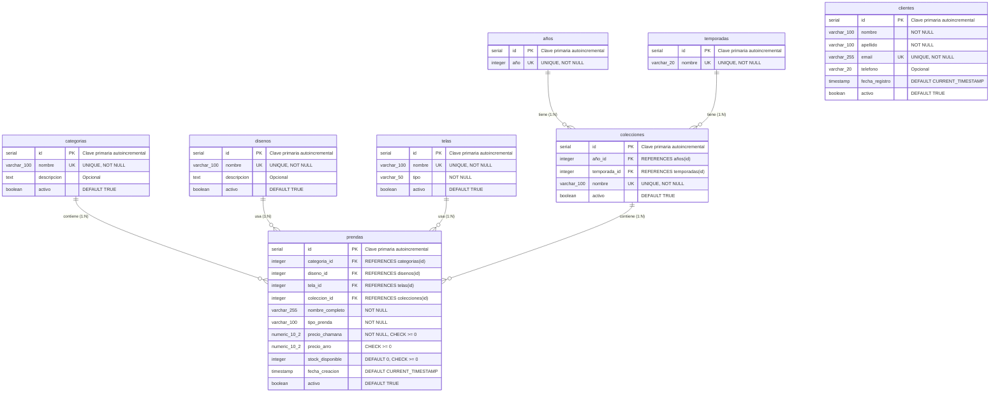

# ERD - Entity-Relationship Diagram (Físico/Técnico)

## Fase 1: Primera Forma Normal (1NF)

**CHAMANA E-commerce - Modelo Físico PostgreSQL Normalizado**

---

## Diagrama Entidad-Relación



---

## Especificaciones Técnicas por Tabla

### Tabla: `categorias`

**Schema**: `public`  
**Propósito**: Clasificar prendas por tipo

| Columna       | Tipo          | Restricciones    | Descripción                    |
| ------------- | ------------- | ---------------- | ------------------------------ |
| `id`          | `SERIAL`      | PRIMARY KEY      | Clave primaria autoincremental |
| `nombre`      | `VARCHAR(100)` | UNIQUE, NOT NULL | Nombre de la categoría         |
| `descripcion` | `TEXT`        | Opcional         | Descripción detallada          |
| `activo`      | `BOOLEAN`     | DEFAULT TRUE     | Estado activo/inactivo         |

**Índices**:

- PRIMARY KEY: `id`
- UNIQUE: `nombre`

**Valores de ejemplo**: Buzo, Remera, Vestido, Palazzo, Pantalón

---

### Tabla: `clientes`

**Schema**: `public`  
**Propósito**: Información de comunicación básica de clientes

| Columna          | Tipo           | Restricciones             | Descripción                    |
| ---------------- | -------------- | ------------------------- | ------------------------------ |
| `id`             | `SERIAL`       | PRIMARY KEY               | Clave primaria autoincremental |
| `nombre`         | `VARCHAR(100)`  | NOT NULL                  | Nombre del cliente             |
| `apellido`       | `VARCHAR(100)`  | NOT NULL                  | Apellido del cliente           |
| `email`          | `VARCHAR(255)`  | UNIQUE, NOT NULL          | Email único del cliente        |
| `telefono`       | `VARCHAR(20)`   | Opcional                  | Teléfono de contacto           |
| `fecha_registro` | `TIMESTAMP`     | DEFAULT CURRENT_TIMESTAMP | Fecha de registro              |
| `activo`         | `BOOLEAN`       | DEFAULT TRUE              | Estado activo/inactivo         |

**Índices**:

- PRIMARY KEY: `id`
- UNIQUE: `email`
- INDEX: `activo` (para consultas de clientes activos)

**Nota**: En esta fase, `clientes` no tiene relaciones directas con otras tablas. Las relaciones con `pedidos` se implementarán en fases futuras.

---

### Tabla: `disenos` ⭐ NUEVA (1NF)

**Schema**: `public`  
**Propósito**: Diseños de prendas normalizados (extraídos de `prendas.nombre_completo`)

| Columna       | Tipo          | Restricciones    | Descripción                    |
| ------------- | ------------- | ---------------- | ------------------------------ |
| `id`          | `SERIAL`      | PRIMARY KEY      | Clave primaria autoincremental |
| `nombre`      | `VARCHAR(100)` | UNIQUE, NOT NULL | Nombre del diseño              |
| `descripcion` | `TEXT`        | Opcional         | Descripción del diseño          |
| `activo`      | `BOOLEAN`     | DEFAULT TRUE     | Estado activo/inactivo         |

**Índices**:

- PRIMARY KEY: `id`
- UNIQUE: `nombre`

**Justificación 1NF**: Extrae diseños repetidos que estaban embebidos en `prendas.nombre_completo` (ej: "Gaia", "Marbella", "Nube") a una entidad separada, eliminando redundancia.

**Valores de ejemplo**: Gaia, Marbella, Nube, Luna, Sol

---

### Tabla: `telas` ⭐ NUEVA (1NF)

**Schema**: `public`  
**Propósito**: Tipos de tela normalizados (extraídos de `prendas.tela_nombre`)

| Columna  | Tipo          | Restricciones    | Descripción                    |
| -------- | ------------- | ---------------- | ------------------------------ |
| `id`      | `SERIAL`      | PRIMARY KEY      | Clave primaria autoincremental |
| `nombre`  | `VARCHAR(100)` | UNIQUE, NOT NULL | Nombre de la tela              |
| `tipo`    | `VARCHAR(50)`  | NOT NULL         | Tipo de tela (ej: Algodón, Modal) |
| `activo`  | `BOOLEAN`     | DEFAULT TRUE     | Estado activo/inactivo         |

**Índices**:

- PRIMARY KEY: `id`
- UNIQUE: `nombre`
- INDEX: `tipo` (para búsquedas por tipo de tela)

**Justificación 1NF**: Normaliza el campo `tela_nombre` que se repetía en múltiples prendas (ej: "Jersey Bordó" aparecía 15 veces) a una entidad separada, eliminando redundancia.

**Valores de ejemplo**: Jersey Bordó, Modal Negro, Algodón Stretch, Frisa Verde

---

### Tabla: `años` ⭐ NUEVA (1NF)

**Schema**: `public`  
**Propósito**: Años disponibles para colecciones

| Columna | Tipo      | Restricciones    | Descripción                    |
| ------- | --------- | ---------------- | ------------------------------ |
| `id`     | `SERIAL`  | PRIMARY KEY      | Clave primaria autoincremental |
| `año`    | `INTEGER`  | UNIQUE, NOT NULL | Año (ej: 2022, 2023, 2024)     |

**Índices**:

- PRIMARY KEY: `id`
- UNIQUE: `año`

**Datos**: 11 registros (2022-2032)

---

### Tabla: `temporadas` ⭐ NUEVA (1NF)

**Schema**: `public`  
**Propósito**: Temporadas del año para clasificar colecciones

| Columna  | Tipo          | Restricciones    | Descripción                    |
| -------- | ------------- | ---------------- | ------------------------------ |
| `id`      | `SERIAL`      | PRIMARY KEY      | Clave primaria autoincremental |
| `nombre`  | `VARCHAR(20)`  | UNIQUE, NOT NULL | Nombre de la temporada         |

**Índices**:

- PRIMARY KEY: `id`
- UNIQUE: `nombre`

**Datos**: 2 registros ('verano', 'invierno')

---

### Tabla: `colecciones` ⭐ NUEVA (1NF)

**Schema**: `public`  
**Propósito**: Colecciones estacionales (combinación de año + temporada)

| Columna        | Tipo          | Restricciones    | Descripción                    |
| -------------- | ------------- | ---------------- | ------------------------------ |
| `id`           | `SERIAL`      | PRIMARY KEY      | Clave primaria autoincremental |
| `año_id`       | `INTEGER`      | FOREIGN KEY      | Referencia a años(id)          |
| `temporada_id` | `INTEGER`      | FOREIGN KEY      | Referencia a temporadas(id)     |
| `nombre`       | `VARCHAR(100)` | UNIQUE, NOT NULL | Nombre de la colección          |
| `activo`       | `BOOLEAN`     | DEFAULT TRUE     | Estado activo/inactivo         |

**Índices**:

- PRIMARY KEY: `id`
- FOREIGN KEY: `año_id` → `años(id)`
- FOREIGN KEY: `temporada_id` → `temporadas(id)`
- UNIQUE: `nombre`
- UNIQUE: `(año_id, temporada_id)` (combinación única)

**Datos**: 22 registros (11 años × 2 temporadas)

**Ejemplos**: "Verano 2024", "Invierno 2024"

---

### Tabla: `prendas` (Modificada para 1NF)

**Schema**: `public`  
**Propósito**: Catálogo de productos normalizado

| Columna           | Tipo            | Restricciones             | Descripción                              |
| ----------------- | --------------- | ------------------------- | ---------------------------------------- |
| `id`              | `SERIAL`        | PRIMARY KEY               | Clave primaria autoincremental           |
| `categoria_id`    | `INTEGER`       | FOREIGN KEY               | Referencia a categorias(id)              |
| `diseno_id`       | `INTEGER`       | FOREIGN KEY               | Referencia a disenos(id)                 |
| `tela_id`         | `INTEGER`       | FOREIGN KEY               | Referencia a telas(id)                  |
| `coleccion_id`    | `INTEGER`       | FOREIGN KEY               | Referencia a colecciones(id) - Opcional |
| `nombre_completo` | `VARCHAR(255)`  | NOT NULL                  | Nombre completo de la prenda             |
| `tipo_prenda`     | `VARCHAR(100)`   | NOT NULL                  | Tipo de prenda (ej: Buzo, Remera)        |
| `precio_chamana`  | `NUMERIC(10,2)`  | NOT NULL, CHECK >= 0      | Precio de venta CHAMANA                  |
| `precio_arro`     | `NUMERIC(10,2)`  | CHECK >= 0                | Precio de venta Arro (opcional)          |
| `stock_disponible`| `INTEGER`       | DEFAULT 0, CHECK >= 0     | Cantidad disponible en inventario        |
| `fecha_creacion`  | `TIMESTAMP`     | DEFAULT CURRENT_TIMESTAMP | Fecha de creación del registro           |
| `activo`          | `BOOLEAN`       | DEFAULT TRUE              | Estado activo/inactivo                   |

**Índices**:

- PRIMARY KEY: `id`
- FOREIGN KEY: `categoria_id` → `categorias(id)`
- FOREIGN KEY: `diseno_id` → `disenos(id)`
- FOREIGN KEY: `tela_id` → `telas(id)`
- FOREIGN KEY: `coleccion_id` → `colecciones(id)`
- INDEX: `tipo_prenda` (para búsquedas por tipo)
- INDEX: `activo` (para filtrar prendas activas)

**Cambios desde Fase 0**:

- ➕ Agregado: `diseno_id` (FK) - Normaliza diseños embebidos
- ➕ Agregado: `tela_id` (FK) - Normaliza telas repetidas
- ➕ Agregado: `coleccion_id` (FK) - Relación con colecciones
- ➖ Removido: `tela_nombre` (redundante, ahora en tabla `telas`)
- 🔄 Modificado: `stock` → `stock_disponible` (nombre más descriptivo)

---

## Relaciones

### categorias → prendas (1:N)

**Tipo**: Uno a Muchos  
**Cardinalidad**: Una categoría puede contener 0 o muchas prendas

- **Clave Foránea**: `prendas.categoria_id` → `categorias.id`
- **Restricción**: Una prenda debe pertenecer a exactamente una categoría
- **Integridad Referencial**: ON DELETE RESTRICT

**Representación Visual**:

```
categorias (1) ||--o{ (N) prendas
```

---

### disenos → prendas (1:N) ⭐ NUEVA

**Tipo**: Uno a Muchos  
**Cardinalidad**: Un diseño puede usarse en 0 o muchas prendas

- **Clave Foránea**: `prendas.diseno_id` → `disenos.id`
- **Restricción**: Una prenda debe tener exactamente un diseño
- **Integridad Referencial**: ON DELETE RESTRICT

**Representación Visual**:

```
disenos (1) ||--o{ (N) prendas
```

---

### telas → prendas (1:N) ⭐ NUEVA

**Tipo**: Uno a Muchos  
**Cardinalidad**: Una tela puede usarse en 0 o muchas prendas

- **Clave Foránea**: `prendas.tela_id` → `telas.id`
- **Restricción**: Una prenda debe tener exactamente una tela
- **Integridad Referencial**: ON DELETE RESTRICT

**Representación Visual**:

```
telas (1) ||--o{ (N) prendas
```

---

### colecciones → prendas (1:N) ⭐ NUEVA

**Tipo**: Uno a Muchos  
**Cardinalidad**: Una colección puede contener 0 o muchas prendas

- **Clave Foránea**: `prendas.coleccion_id` → `colecciones.id`
- **Restricción**: Una prenda puede pertenecer a 0 o 1 colección (opcional)
- **Integridad Referencial**: ON DELETE SET NULL (permite prendas sin colección)

**Representación Visual**:

```
colecciones (1) ||--o{ (N) prendas
```

---

### años → colecciones (1:N) ⭐ NUEVA

**Tipo**: Uno a Muchos  
**Cardinalidad**: Un año puede tener 0 o muchas colecciones

- **Clave Foránea**: `colecciones.año_id` → `años.id`
- **Restricción**: Una colección debe pertenecer a exactamente un año
- **Integridad Referencial**: ON DELETE RESTRICT

**Representación Visual**:

```
años (1) ||--o{ (N) colecciones
```

---

### temporadas → colecciones (1:N) ⭐ NUEVA

**Tipo**: Uno a Muchos  
**Cardinalidad**: Una temporada puede tener 0 o muchas colecciones

- **Clave Foránea**: `colecciones.temporada_id` → `temporadas.id`
- **Restricción**: Una colección debe pertenecer a exactamente una temporada
- **Integridad Referencial**: ON DELETE RESTRICT

**Representación Visual**:

```
temporadas (1) ||--o{ (N) colecciones
```

---

## Restricciones de Integridad

### CHECK Constraints

```sql
-- Precios no negativos
CHECK (precio_chamana >= 0)
CHECK (precio_arro >= 0)

-- Stock no negativo
CHECK (stock_disponible >= 0)
```

### UNIQUE Constraints

```sql
-- Email único por cliente
UNIQUE (email) -- en tabla clientes

-- Nombre único por categoría
UNIQUE (nombre) -- en tabla categorias

-- Nombre único por diseño
UNIQUE (nombre) -- en tabla disenos

-- Nombre único por tela
UNIQUE (nombre) -- en tabla telas

-- Año único
UNIQUE (año) -- en tabla años

-- Nombre único por temporada
UNIQUE (nombre) -- en tabla temporadas

-- Nombre único por colección
UNIQUE (nombre) -- en tabla colecciones

-- Combinación única año+temporada por colección
UNIQUE (año_id, temporada_id) -- en tabla colecciones
```

### DEFAULT Values

```sql
-- Valores por defecto
fecha_registro: CURRENT_TIMESTAMP
fecha_creacion: CURRENT_TIMESTAMP
activo/activo: TRUE
stock_disponible: 0
```

### FOREIGN KEY Constraints

```sql
-- Relación categorias → prendas
FOREIGN KEY (categoria_id) 
  REFERENCES categorias(id)
  ON DELETE RESTRICT

-- Relación disenos → prendas
FOREIGN KEY (diseno_id) 
  REFERENCES disenos(id)
  ON DELETE RESTRICT

-- Relación telas → prendas
FOREIGN KEY (tela_id) 
  REFERENCES telas(id)
  ON DELETE RESTRICT

-- Relación colecciones → prendas
FOREIGN KEY (coleccion_id) 
  REFERENCES colecciones(id)
  ON DELETE SET NULL

-- Relación años → colecciones
FOREIGN KEY (año_id) 
  REFERENCES años(id)
  ON DELETE RESTRICT

-- Relación temporadas → colecciones
FOREIGN KEY (temporada_id) 
  REFERENCES temporadas(id)
  ON DELETE RESTRICT
```

---

## Índices Adicionales

```sql
-- Índices para mejorar rendimiento de consultas
CREATE INDEX idx_prendas_categoria ON prendas(categoria_id);
CREATE INDEX idx_prendas_diseno ON prendas(diseno_id);
CREATE INDEX idx_prendas_tela ON prendas(tela_id);
CREATE INDEX idx_prendas_coleccion ON prendas(coleccion_id);
CREATE INDEX idx_prendas_tipo_prenda ON prendas(tipo_prenda);
CREATE INDEX idx_prendas_activo ON prendas(activo);
CREATE INDEX idx_colecciones_año ON colecciones(año_id);
CREATE INDEX idx_colecciones_temporada ON colecciones(temporada_id);
CREATE INDEX idx_telas_tipo ON telas(tipo);
CREATE INDEX idx_clientes_activo ON clientes(activo);
```

---

## Estadísticas del Modelo

| Tabla          | Columnas | Índices | Relaciones        | Estado             |
| -------------- | -------- | ------- | ------------------ | ------------------ |
| `categorias`   | 4        | 2       | 1 (salida)         | ✅ Implementado    |
| `clientes`     | 7        | 2       | 0                  | ✅ Implementado    |
| `disenos`      | 4        | 2       | 1 (salida)         | ⭐ Nueva (1NF)     |
| `telas`        | 4        | 3       | 1 (salida)         | ⭐ Nueva (1NF)     |
| `años`         | 2        | 2       | 1 (salida)         | ⭐ Nueva (1NF)     |
| `temporadas`   | 2        | 2       | 1 (salida)         | ⭐ Nueva (1NF)     |
| `colecciones`  | 5        | 4       | 3 (2 entrada, 1 salida) | ⭐ Nueva (1NF) |
| `prendas`      | 12       | 7       | 4 (entrada)        | 🔄 Modificada (1NF) |

**Total**: 8 tablas, 40 columnas, 24 índices, 6 relaciones

---

## Normalización 1NF Aplicada

### Antes (Fase 0 - Pre-normalizado)

```
prendas.nombre_completo = "Gaia - Jersey Bordó" (diseño + tela embebidos)
prendas.tela_nombre = "Jersey Bordó" (repetido 15 veces)
prendas.tipo = "Buzo" (redundante con categorias)
```

**Problemas**:

- ❌ Valores compuestos (diseño + tela en un campo)
- ❌ Redundancia de datos (misma tela repetida)
- ❌ Dificultad para actualizar (cambiar nombre de tela requiere múltiples updates)

### Después (Fase 1 - 1NF)

```
disenos.id = 1, nombre = "Gaia"
telas.id = 5, nombre = "Jersey Bordó"
prendas.diseno_id = 1 (referencia)
prendas.tela_id = 5 (referencia)
```

**Beneficios**:

- ✅ Valores atómicos (cada campo contiene un solo valor)
- ✅ Eliminación de redundancia (tela almacenada una sola vez)
- ✅ Facilita actualizaciones (cambiar nombre de tela en un solo lugar)
- ✅ Permite consultas eficientes por diseño o tela
- ✅ Mejora integridad de datos (foreign keys garantizan consistencia)

### Transformación de Datos

**Ejemplo de migración**:

```sql
-- Fase 0 (pre-normalizado)
INSERT INTO prendas (nombre_completo, tela_nombre, ...) 
VALUES ('Gaia - Jersey Bordó', 'Jersey Bordó', ...);

-- Fase 1 (normalizado)
INSERT INTO disenos (nombre) VALUES ('Gaia');
INSERT INTO telas (nombre, tipo) VALUES ('Jersey Bordó', 'Jersey');
INSERT INTO prendas (diseno_id, tela_id, nombre_completo, ...) 
VALUES (1, 5, 'Gaia - Jersey Bordó', ...);
```

---

## Notas de Diseño

### ✅ Normalización Completa a 1NF

Este modelo está **completamente normalizado a 1NF**:

1. **Valores Atómicos**: Cada campo contiene un solo valor
   - `nombre_completo` se mantiene para display, pero los componentes están normalizados
   - Diseños y telas extraídos a tablas separadas

2. **Eliminación de Redundancia**:
   - Telas repetidas → tabla `telas`
   - Diseños repetidos → tabla `disenos`
   - Años y temporadas → tablas separadas

3. **Integridad Referencial**:
   - Foreign keys garantizan consistencia
   - ON DELETE RESTRICT previene eliminaciones accidentales
   - ON DELETE SET NULL para relaciones opcionales

### Forma Normal Actual

- **Estado**: ✅ 1NF (completa)
- **Características**: Valores atómicos, sin grupos repetidos, sin redundancia
- **Próximo objetivo**: 2NF (eliminar dependencias parciales)

---

**Base de Datos**: `chamana_db_fase1`  
**SGBD**: PostgreSQL 12+  
**Schema**: `public`  
**Forma Normal**: ✅ 1NF (completa)  
**Estado**: ✅ Implementado - Normalización completa aplicada

