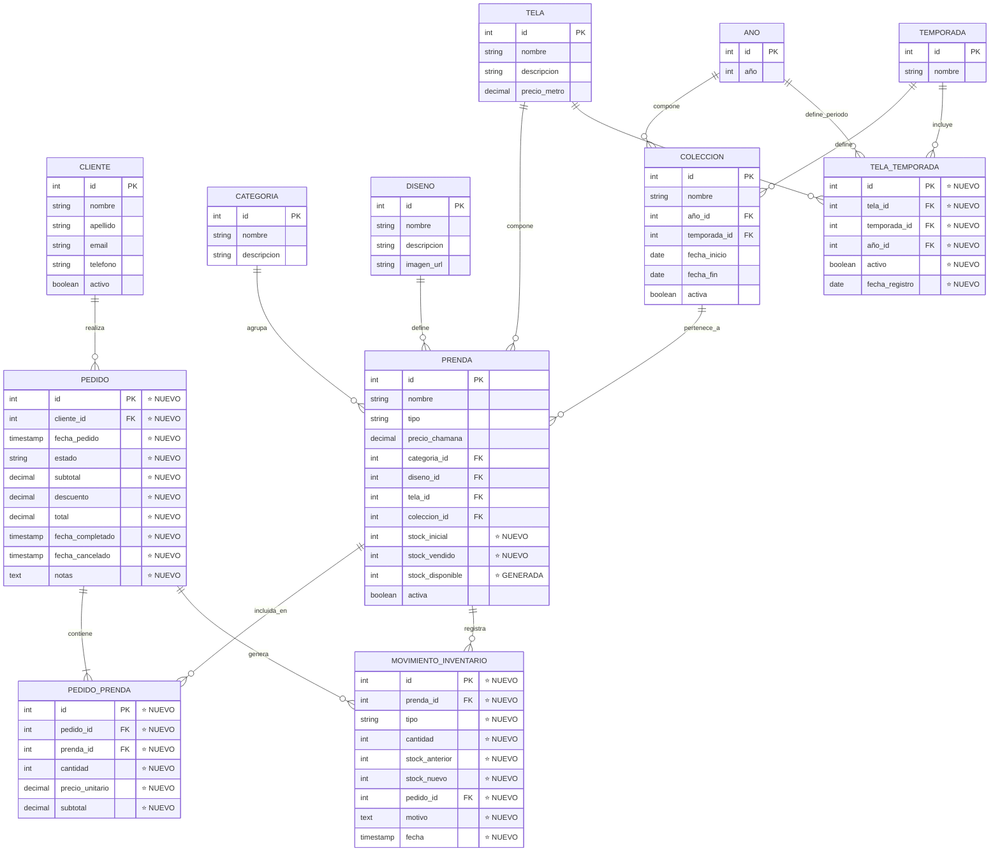

# MER - Modelo Entidad-Relación (Conceptual)

## Fase 2: Segunda Forma Normal (2NF)

**CHAMANA E-commerce - Sistema Completo con Órdenes e Inventario**

---

## Sistema Completo: 12 Entidades

---

## Descripción de Entidades

### 🔵 Entidades Base (desde Fase 1)

- **CLIENTE**: Información de clientes de CHAMANA
- **CATEGORIA**: Clasificación de prendas (Blusa, Pantalón, etc.)
- **DISENO**: Diseños reutilizables para prendas
- **TELA**: Tipos de tela disponibles
- **ANO**: Tabla de referencia para años
- **TEMPORADA**: Temporadas (Verano, Invierno)
- **COLECCION**: Agrupa prendas por temporada y año

### 🟢 Entidad Mejorada (Fase 1 → Fase 2)

#### PRENDA ⭐ MEJORADA

**Cambios en Fase 2**:

- ✅ **Agregado**: `stock_inicial` (inventario base)
- ✅ **Agregado**: `stock_vendido` (cantidad vendida)
- ✅ **Agregado**: `stock_disponible` (columna generada: `stock_inicial - stock_vendido`)
- ✅ **Mejorado**: Sistema de relaciones para pedidos e inventario

### 🆕 Nuevas Entidades (Fase 2 - 2NF)

#### PEDIDO ⭐ NUEVA

**Propósito**: Representa órdenes de compra de clientes

- Estados: pendiente, completado, cancelado
- Gestión de descuentos y totales
- Trazabilidad de fechas de cambio de estado

#### PEDIDO_PRENDA ⭐ NUEVA (Junction Table)

**Propósito**: Líneas de pedido (items individuales)

- **Justificación 2NF**: Elimina dependencia parcial
- Atributos (`cantidad`, `precio_unitario`) dependen completamente de `(pedido_id, prenda_id)`

#### TELA_TEMPORADA ⭐ NUEVA (Junction Table)

**Propósito**: Disponibilidad de telas por temporada y año

- **Justificación 2NF**: Elimina dependencia parcial
- Una tela puede estar disponible en múltiples temporadas/años sin duplicar datos

#### MOVIMIENTO_INVENTARIO ⭐ NUEVA

**Propósito**: Auditoría de cambios en stock

- Tipos: venta, ajuste, devolución
- Historial completo de todos los cambios
- Trazabilidad con pedidos específicos

---

## Relaciones Principales

| Relación                   | Cardinalidad | Descripción                            |
| -------------------------- | ------------ | -------------------------------------- |
| CLIENTE → PEDIDO           | 1:N          | Un cliente puede tener muchos pedidos  |
| PEDIDO → PEDIDO_PRENDA     | 1:N          | Un pedido contiene muchas líneas       |
| PRENDA → PEDIDO_PRENDA     | 1:N          | Una prenda aparece en muchos pedidos   |
| PRENDA → MOVIMIENTO_INV    | 1:N          | Una prenda tiene múltiples movimientos |
| PEDIDO → MOVIMIENTO_INV    | 1:N          | Un pedido genera movimientos de stock  |
| TELA → TELA_TEMPORADA      | 1:N          | Una tela en múltiples temporadas       |
| TEMPORADA → TELA_TEMPORADA | 1:N          | Una temporada incluye múltiples telas  |
| ANO → TELA_TEMPORADA       | 1:N          | Un año define disponibilidad           |

---

## Cumplimiento de 2NF

### Principios Aplicados

1. **✅ Está en 1NF**: Todas las tablas tienen claves primarias únicas y valores atómicos
2. **✅ No hay dependencias parciales**: Todos los atributos no-clave dependen de la clave primaria completa

### Junction Tables (Eliminan Dependencias Parciales)

#### PEDIDO_PRENDA

**Correcto (2NF)**:

- `cantidad` depende de **ambos** `pedido_id` y `prenda_id`
- `precio_unitario` depende de **ambos** `pedido_id` y `prenda_id`
- No hay dependencias parciales

#### TELA_TEMPORADA

**Correcto (2NF)**:

- `activo` depende de **(tela, temporada, año)** completo
- `fecha_registro` depende de **(tela, temporada, año)** completo
- No hay dependencias parciales

---

## Estadísticas

| Entidad           | Registros |
| ----------------- | --------- |
| CLIENTE           | 20        |
| CATEGORIA         | 5         |
| DISENO            | 8         |
| TELA              | 14        |
| ANO               | 11        |
| TEMPORADA         | 2         |
| COLECCION         | 22        |
| PRENDA            | 30        |
| PEDIDO ⭐         | 8         |
| PEDIDO_PRENDA ⭐  | 13        |
| TELA_TEMPORADA ⭐ | 23        |
| MOVIMIENTO_INV ⭐ | 6         |

---

## Ventajas del Modelo 2NF

1. **✅ Sin Redundancia de Datos**: Información no se duplica innecesariamente
2. **✅ Integridad Referencial**: Foreign keys mantienen consistencia
3. **✅ Flexibilidad**: Fácil agregar nuevas temporadas, telas, pedidos
4. **✅ Auditoría**: `movimientos_inventario` registra todos los cambios
5. **✅ Escalabilidad**: Modelo soporta crecimiento sin reestructuración
6. **✅ Consultas Eficientes**: Junction tables permiten queries complejos

---

**Base de Datos**: `chamana_db_fase2`  
**Forma Normal**: 2NF (Segunda Forma Normal)  
**Estado**: Sin dependencias parciales  
**Próxima fase**: 3NF (Tercera Forma Normal)
