# MER - Modelo Entidad-Relación (Conceptual)

## Fase 3: Tercera Forma Normal (3NF) + Business Intelligence

**CHAMANA E-commerce - Sistema Completo con Normalización 3NF y BI**

---

## Sistema Completo: 19 Entidades

```mermaid
erDiagram
    %% ENTIDADES BASE (desde Fase 2)

    CLIENTE ||--o{ PEDIDO : "realiza"
    CLIENTE ||--o{ DIRECCION : "tiene"
    CLIENTE {
        int id PK
        string nombre
        string apellido
        string email UK
        string telefono
        boolean activo
        timestamp created_at
    }

    DIRECCION {
        int id PK "⭐ NUEVO 3NF"
        int cliente_id FK "⭐ NUEVO 3NF"
        string tipo "⭐ NUEVO 3NF"
        string calle "⭐ NUEVO 3NF"
        string ciudad "⭐ NUEVO 3NF"
        string estado "⭐ NUEVO 3NF"
        string codigo_postal "⭐ NUEVO 3NF"
        string pais "⭐ NUEVO 3NF"
        boolean predeterminada "⭐ NUEVO 3NF"
    }

    PEDIDO ||--|{ PEDIDO_PRENDA : "contiene"
    PEDIDO }o--|| ESTADO_PEDIDO : "tiene estado"
    PEDIDO }o--|| METODO_PAGO : "pagado con"
    PEDIDO }o--o| DIRECCION : "envío a"
    PEDIDO ||--o{ HISTORIAL_ESTADO : "registra cambios"
    PEDIDO {
        int id PK
        int cliente_id FK
        int estado_id FK "⭐ NUEVO 3NF"
        int metodo_pago_id FK "⭐ NUEVO 3NF"
        int direccion_envio_id FK "⭐ NUEVO 3NF"
        decimal subtotal
        decimal descuento
        decimal total
        timestamp fecha_pedido
        timestamp fecha_completado
    }

    ESTADO_PEDIDO {
        int id PK "⭐ NUEVO 3NF"
        string nombre UK "⭐ NUEVO 3NF"
        text descripcion "⭐ NUEVO 3NF"
        int orden_workflow "⭐ NUEVO 3NF"
    }

    METODO_PAGO {
        int id PK "⭐ NUEVO 3NF"
        string codigo UK "⭐ NUEVO 3NF"
        string nombre "⭐ NUEVO 3NF"
        string tipo "⭐ NUEVO 3NF"
        decimal comision "⭐ NUEVO 3NF"
        int orden "⭐ NUEVO 3NF"
    }

    HISTORIAL_ESTADO {
        int id PK "⭐ NUEVO 3NF"
        int pedido_id FK "⭐ NUEVO 3NF"
        int estado_anterior_id FK "⭐ NUEVO 3NF"
        int estado_nuevo_id FK "⭐ NUEVO 3NF"
        timestamp fecha_cambio "⭐ NUEVO 3NF"
        int usuario_id "⭐ NUEVO 3NF"
    }

    PEDIDO_PRENDA {
        int id PK
        int pedido_id FK
        int prenda_id FK
        int cantidad
        decimal precio_unitario
        decimal subtotal
    }

    PRENDA ||--o{ PEDIDO_PRENDA : "incluida_en"
    PRENDA }o--|| TIPO_PRENDA : "es de tipo"
    PRENDA }o--|| AÑO : "colección"
    PRENDA }o--|| TELA : "material"
    PRENDA }o--|| PATRON : "diseño"
    PRENDA }o--|| ARTESANO : "confeccionada por"
    PRENDA ||--o{ MOVIMIENTO_INVENTARIO : "registra movimientos"
    PRENDA {
        int id PK
        string nombre
        int tipo_prenda_id FK "⭐ NUEVO 3NF"
        int año_id FK
        int tela_id FK
        int patron_id FK
        int artesano_id FK
        decimal precio_chamana
        int stock_inicial
        int stock_vendido
        boolean activa
        timestamp fecha_ultima_venta
    }

    TIPO_PRENDA {
        int id PK "⭐ NUEVO 3NF"
        string nombre UK "⭐ NUEVO 3NF"
        text descripcion "⭐ NUEVO 3NF"
        text cuidados "⭐ NUEVO 3NF"
    }

    CATEGORIA ||--o{ PRENDA : "agrupa"
    CATEGORIA {
        int id PK
        string nombre UK
        string descripcion
    }

    DISENO ||--o{ PRENDA : "define"
    DISENO {
        int id PK
        string nombre
        string descripcion
    }

    TELA ||--o{ PRENDA : "compone"
    TELA ||--o{ TELA_PROVEEDOR : "suministrada por"
    TELA {
        int id PK
        string nombre UK
        text descripcion
        string unidad
    }

    PROVEEDOR ||--o{ TELA_PROVEEDOR : "suministra"
    PROVEEDOR {
        int id PK "⭐ NUEVO 3NF"
        string nombre "⭐ NUEVO 3NF"
        string contacto "⭐ NUEVO 3NF"
        string telefono "⭐ NUEVO 3NF"
    }

    TELA_PROVEEDOR {
        int id PK "⭐ NUEVO 3NF"
        int tela_id FK "⭐ NUEVO 3NF"
        int proveedor_id FK "⭐ NUEVO 3NF"
        decimal precio_proveedor "⭐ NUEVO 3NF"
    }

    AÑO ||--o{ PRENDA : "colección"
    AÑO {
        int id PK
        int año UK
        string temporada
    }

    TEMPORADA ||--o{ COLECCION : "define"
    TEMPORADA {
        int id PK
        string nombre UK
    }

    COLECCION ||--o{ PRENDA : "pertenece_a"
    COLECCION {
        int id PK
        string nombre
        int año_id FK
        int temporada_id FK
        date fecha_inicio
        date fecha_fin
        boolean activa
    }

    PATRON ||--o{ PRENDA : "diseño"
    PATRON {
        int id PK
        string nombre UK
        text descripcion
        string origen
    }

    ARTESANO ||--o{ PRENDA : "confeccionada por"
    ARTESANO {
        int id PK
        string nombre
        string especialidad
        string comunidad
    }

    MOVIMIENTO_INVENTARIO {
        int id PK
        int prenda_id FK
        string tipo
        int cantidad
        int stock_anterior
        int stock_nuevo
        int pedido_id FK
        text motivo
        timestamp fecha
    }
```

---

## Descripción de Entidades

### 🔵 Entidades Base (desde Fase 2)

- **CLIENTE**: Información de clientes de CHAMANA
- **CATEGORIA**: Clasificación de prendas (Blusa, Pantalón, etc.)
- **DISENO**: Diseños reutilizables para prendas
- **TELA**: Tipos de tela disponibles
- **AÑO**: Tabla de referencia para años (mejorada con temporada)
- **TEMPORADA**: Temporadas (Verano, Invierno)
- **COLECCION**: Agrupa prendas por temporada y año
- **PEDIDO**: Órdenes de compra de clientes
- **PEDIDO_PRENDA**: Líneas de pedido (items individuales)
- **PRENDA**: Productos de CHAMANA con relaciones normalizadas
- **MOVIMIENTO_INVENTARIO**: Auditoría de cambios en stock
- **PATRON**: Patrones de diseño (renombrado desde DISENO)
- **ARTESANO**: Artesanos que confeccionan prendas

### 🆕 Nuevas Entidades (Fase 3 - 3NF)

#### DIRECCION ⭐ NUEVA (3NF)

**Propósito**: Elimina dependencia transitiva de direcciones en `clientes`

- **Justificación 3NF**: Direcciones dependen de cliente, no de otros atributos de cliente
- Permite múltiples direcciones por cliente (envío, facturación)
- Soporta direcciones predeterminadas

#### ESTADO_PEDIDO ⭐ NUEVA (3NF)

**Propósito**: Normaliza estados de pedido en tabla de referencia

- **Justificación 3NF**: Estados son entidades independientes con workflow
- Estados: pendiente, confirmado, en_proceso, enviado, entregado, cancelado, devuelto
- Incluye orden de workflow para validaciones

#### METODO_PAGO ⭐ NUEVA (3NF)

**Propósito**: Catálogo normalizado de métodos de pago

- **Justificación 3NF**: Métodos de pago son entidades independientes
- Incluye comisiones y configuración por método
- Facilita agregar nuevos métodos sin modificar estructura

#### HISTORIAL_ESTADO ⭐ NUEVA (3NF)

**Propósito**: Auditoría completa de cambios de estado en pedidos

- **Justificación 3NF**: Historial es entidad independiente con su propia lógica
- Rastrea transiciones de estado (anterior → nuevo)
- Incluye usuario y timestamp para trazabilidad completa

#### TIPO_PRENDA ⭐ NUEVA (3NF)

**Propósito**: Elimina dependencia transitiva de tipo en `prendas`

- **Justificación 3NF**: Tipos de prenda son entidades con atributos propios
- Incluye descripción y cuidados específicos por tipo
- Facilita gestión de catálogo de tipos

#### PROVEEDOR ⭐ NUEVA (3NF)

**Propósito**: Gestión de proveedores de telas

- **Justificación 3NF**: Proveedores son entidades independientes
- Permite múltiples proveedores por tela
- Facilita comparación de precios y gestión de compras

#### TELA_PROVEEDOR ⭐ NUEVA (3NF - Junction Table)

**Propósito**: Relación M:N entre telas y proveedores con precios

- **Justificación 3NF**: Elimina dependencia transitiva de proveedor en telas
- Una tela puede tener múltiples proveedores con precios diferentes
- Facilita comparación y selección de proveedores

---

## Relaciones Principales

| Relación                      | Cardinalidad | Descripción                                  |
| ----------------------------- | ------------ | -------------------------------------------- |
| CLIENTE → PEDIDO              | 1:N          | Un cliente puede tener muchos pedidos        |
| CLIENTE → DIRECCION ⭐        | 1:N          | Un cliente puede tener múltiples direcciones |
| PEDIDO → PEDIDO_PRENDA        | 1:N          | Un pedido contiene muchas líneas             |
| PEDIDO → ESTADO_PEDIDO ⭐     | N:1          | Un pedido tiene un estado actual             |
| PEDIDO → METODO_PAGO ⭐       | N:1          | Un pedido usa un método de pago              |
| PEDIDO → DIRECCION ⭐         | N:1          | Un pedido se envía a una dirección           |
| PEDIDO → HISTORIAL_ESTADO ⭐  | 1:N          | Un pedido tiene múltiples cambios de estado  |
| PRENDA → PEDIDO_PRENDA        | 1:N          | Una prenda aparece en muchos pedidos         |
| PRENDA → TIPO_PRENDA ⭐       | N:1          | Una prenda es de un tipo específico          |
| PRENDA → MOVIMIENTO_INV       | 1:N          | Una prenda tiene múltiples movimientos       |
| TELA → TELA_PROVEEDOR ⭐      | 1:N          | Una tela puede tener múltiples proveedores   |
| PROVEEDOR → TELA_PROVEEDOR ⭐ | 1:N          | Un proveedor suministra múltiples telas      |

---

## Cumplimiento de 3NF

### Principios Aplicados

1. **✅ Está en 1NF**: Todas las tablas tienen claves primarias únicas y valores atómicos
2. **✅ Está en 2NF**: No hay dependencias parciales
3. **✅ Está en 3NF**: No hay dependencias transitivas

### Eliminación de Dependencias Transitivas

#### DIRECCION

**Antes (2NF)**: `clientes.direccion` dependía transitivamente de `clientes.id`

**Ahora (3NF)**: `direcciones` es entidad independiente

- Depende directamente de `cliente_id`
- Permite múltiples direcciones por cliente
- Facilita gestión de direcciones de envío y facturación

#### ESTADO_PEDIDO

**Antes (2NF)**: `pedidos.estado` era string libre

**Ahora (3NF)**: `estados_pedido` es tabla de referencia

- Estados normalizados con workflow
- Validación de transiciones de estado
- Facilita agregar nuevos estados

#### TIPO_PRENDA

**Antes (2NF)**: `prendas.tipo` era string libre

**Ahora (3NF)**: `tipos_prenda` es tabla de referencia

- Tipos normalizados con descripción y cuidados
- Facilita gestión de catálogo
- Permite agregar atributos específicos por tipo

#### PROVEEDOR + TELA_PROVEEDOR

**Antes (2NF)**: Información de proveedor mezclada con telas

**Ahora (3NF)**: Separación clara

- `proveedores` es entidad independiente
- `telas_proveedores` maneja relación M:N con precios
- Facilita comparación de proveedores

---

## Business Intelligence (Vistas)

### 📊 Vistas de Análisis

1. **vista_ventas_mensuales** - Ventas agrupadas por mes
2. **vista_inventario_critico** - Alertas de stock bajo con categorización
3. **vista_top_productos** - Productos más vendidos por ingresos
4. **vista_analisis_clientes** - Segmentación de clientes (VIP, Activos, Inactivos)
5. **vista_rotacion_inventario** - Análisis de rotación de stock

---

## Lógica de Negocio

### 🔧 Procedimientos Almacenados

1. **procesar_pedido()** - Valida stock, crea pedido, actualiza inventario
2. **reabastecer_inventario()** - Reabastece stock con auditoría
3. **calcular_comision_vendedor()** - Calcula comisiones diarias de ventas

### ⚡ Triggers Automáticos

1. **trigger_actualizar_stock_pedido** - Actualiza stock al procesar pedido
2. **trigger_registrar_historial_estado** - Registra cambios de estado automáticamente
3. **trigger_alertar_stock_critico** - Genera alertas cuando stock es crítico

---

## Estadísticas

| Entidad             | Registros | Notas                   |
| ------------------- | --------- | ----------------------- |
| CLIENTE             | 20        |                         |
| DIRECCION ⭐        | ~30       | Múltiples por cliente   |
| CATEGORIA           | 5         |                         |
| DISENO              | 8         |                         |
| TELA                | 14        |                         |
| AÑO                 | 11        |                         |
| TEMPORADA           | 2         |                         |
| COLECCION           | 22        |                         |
| PRENDA              | 30        |                         |
| TIPO_PRENDA ⭐      | 5         | Blusa, Vestido, etc.    |
| PATRON              | 8         |                         |
| ARTESANO            | 5         |                         |
| PEDIDO              | 8         |                         |
| ESTADO_PEDIDO ⭐    | 7         | Estados del workflow    |
| METODO_PAGO ⭐      | 5         | Efectivo, Tarjeta, etc. |
| HISTORIAL_ESTADO ⭐ | ~15       | Cambios de estado       |
| PEDIDO_PRENDA       | 13        |                         |
| PROVEEDOR ⭐        | 3         | Proveedores de telas    |
| TELA_PROVEEDOR ⭐   | ~20       | Relaciones M:N          |
| MOVIMIENTO_INV      | 6         |                         |

---

## Ventajas del Modelo 3NF

1. **✅ Sin Dependencias Transitivas**: Todas las dependencias son directas
2. **✅ Flexibilidad Máxima**: Fácil agregar nuevos estados, métodos de pago, tipos
3. **✅ Auditoría Completa**: Historial de estados y movimientos de inventario
4. **✅ Múltiples Direcciones**: Clientes pueden tener varias direcciones
5. **✅ Gestión de Proveedores**: Comparación de precios y múltiples proveedores
6. **✅ Business Intelligence**: Vistas optimizadas para análisis
7. **✅ Lógica de Negocio**: Procedimientos y triggers automatizan operaciones
8. **✅ Escalabilidad**: Modelo soporta crecimiento sin reestructuración
9. **✅ Integridad Referencial**: Foreign keys mantienen consistencia
10. **✅ Consultas Eficientes**: Estructura normalizada permite queries complejos

---

## Mejoras vs Fase 2

### Normalización 3NF

- ✅ **7 nuevas tablas** eliminan dependencias transitivas
- ✅ **Direcciones normalizadas** (múltiples por cliente)
- ✅ **Estados de pedido normalizados** (workflow estructurado)
- ✅ **Tipos de prenda normalizados** (catálogo centralizado)
- ✅ **Proveedores normalizados** (gestión de múltiples proveedores)

### Business Intelligence

- ✅ **5 vistas optimizadas** para análisis y reportes
- ✅ **Datos pre-calculados** mejoran rendimiento de consultas
- ✅ **Segmentación de clientes** para marketing

### Automatización

- ✅ **3 procedimientos almacenados** encapsulan lógica de negocio
- ✅ **3 triggers automáticos** validan y registran cambios
- ✅ **Auditoría completa** de todos los cambios importantes

---

**Base de Datos**: `chamana_db_fase3`  
**Forma Normal**: 3NF (Tercera Forma Normal)  
**Estado**: Sin dependencias transitivas, con BI y automatización  
**Próxima fase**: Optimización y producción (Phase 4)

---

**Autor**: Gabriel Osemberg  
**Proyecto**: CHAMANA - E-commerce de Ropa Femenina  
**Fecha**: Noviembre 2025
