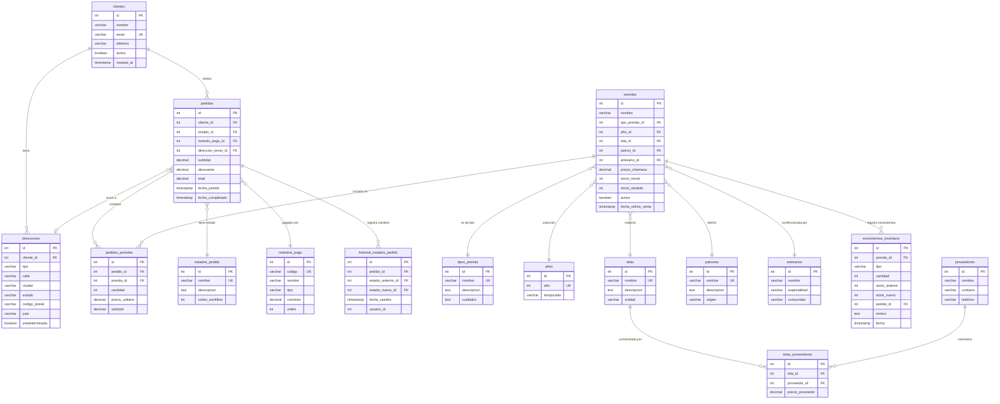

# DER - Fase 3 (3NF)

**Autor**: Gabriel Osemberg
**Fecha**: Noviembre 2025

---

## Diagrama Entidad-Relación (Mermaid)

---

## Resumen

### Tablas: 19
1. clientes
2. direcciones ⭐ 3NF
3. pedidos
4. estados_pedido ⭐ 3NF
5. metodos_pago ⭐ 3NF
6. historial_estados_pedido ⭐ 3NF
7. pedidos_prendas
8. prendas
9. tipos_prenda ⭐ 3NF
10. años
11. telas
12. patrones
13. artesanos
14. proveedores ⭐ 3NF
15. telas_proveedores ⭐ 3NF
16. movimientos_inventario ⭐ 3NF

### Relaciones (Foreign Keys): 14

### Vistas (Business Intelligence): 5
1. vista_ventas_mensuales
2. vista_inventario_critico
3. vista_top_productos
4. vista_analisis_clientes
5. vista_rotacion_inventario

### Procedimientos Almacenados: 3
1. procesar_pedido()
2. reabastecer_inventario()
3. calcular_comision_vendedor()

### Triggers: 3
1. trigger_actualizar_stock_pedido
2. trigger_registrar_historial_estado
3. trigger_alertar_stock_critico

---

## Mejoras vs Fase 2

✅ **Eliminación de dependencias transitivas**:
- Direcciones separadas de clientes
- Estados de pedido normalizados
- Tipos de prenda centralizados
- Métodos de pago estandarizados

✅ **Auditoría completa**:
- historial_estados_pedido rastrea todos los cambios
- movimientos_inventario registra todas las operaciones

✅ **Business Intelligence**:
- 5 vistas optimizadas para análisis
- Datos pre-calculados para reportes

✅ **Lógica de negocio en base de datos**:
- Procedimientos almacenados encapsulan operaciones complejas
- Triggers automatizan validaciones

✅ **Escalabilidad**:
- Múltiples direcciones por cliente
- Múltiples proveedores por tela
- Historial ilimitado de estados

---

**Autor**: Gabriel Osemberg
**Proyecto**: CHAMANA - E-commerce de Ropa Femenina
**Fecha**: Noviembre 2025
