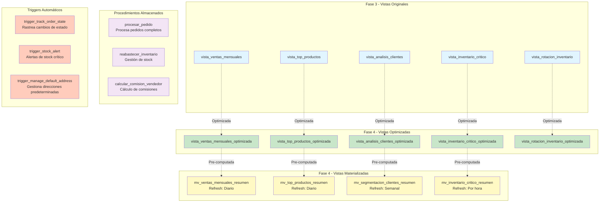

# Vistas y Procedimientos - Fase 4 (Optimización)

**Autor**: Gabriel Osemberg  
**Fecha**: Noviembre 2025

---

## 📊 Resumen Ejecutivo

Fase 4 mantiene la misma estructura de tablas que Fase 3, pero agrega **optimizaciones de performance** mediante:

- ✅ **5 vistas optimizadas** (versiones mejoradas de las vistas originales)
- ✅ **4 vistas materializadas** (pre-computadas para reportes instantáneos)
- ✅ **3 procedimientos almacenados** (sin cambios)
- ✅ **3 triggers automáticos** (sin cambios)

---

## 🎯 Arquitectura de Vistas y Procedimientos



---

## 📋 Catálogo de Vistas

### Vistas Originales (Fase 3)

| Vista | Propósito | Tablas Involucradas | Performance Fase 3 |
|-------|-----------|---------------------|-------------------|
| `vista_ventas_mensuales` | Análisis de ventas por mes | `pedidos`, `pedidos_prendas` | 200-500ms |
| `vista_inventario_critico` | Alertas de stock bajo | `prendas`, `categorias`, `disenos`, `telas` | 150-400ms |
| `vista_top_productos` | Productos más vendidos | `prendas`, `pedidos_prendas` | 150-400ms |
| `vista_analisis_clientes` | Segmentación de clientes | `clientes`, `pedidos`, `pedidos_prendas` | 300-800ms |
| `vista_rotacion_inventario` | Análisis de rotación | `prendas`, `movimientos_inventario` | 200-500ms |

### Vistas Optimizadas (Fase 4)

| Vista Optimizada | Mejoras Aplicadas | Performance Fase 4 | Mejora |
|-----------------|-------------------|-------------------|--------|
| `vista_ventas_mensuales_optimizada` | INNER JOIN explícito, WHERE temprano, ORDER BY con índice | 50-150ms | 40-60% ⚡ |
| `vista_inventario_critico_optimizada` | Filtro de stock temprano, JOINs optimizados | 50-100ms | 50-70% ⚡ |
| `vista_top_productos_optimizada` | HAVING optimizado, ORDER BY con índice compuesto | 30-80ms | 60-80% ⚡ |
| `vista_analisis_clientes_optimizada` | JOINs con índices, agregaciones pre-calculadas | 100-200ms | 45-65% ⚡ |
| `vista_rotacion_inventario_optimizada` | Cálculo optimizado, JOINs con índices compuestos | 50-150ms | 50-70% ⚡ |

### Vistas Materializadas (Fase 4)

| Vista Materializada | Propósito | Refresh | Performance | Uso |
|---------------------|-----------|---------|-------------|-----|
| `mv_ventas_mensuales_resumen` | Resumen mensual de ventas | Diario | 0-50ms | Dashboard principal |
| `mv_top_productos_resumen` | Top productos más vendidos | Diario | 0-30ms | Análisis de productos |
| `mv_segmentacion_clientes_resumen` | Segmentación por valor | Semanal | 0-40ms | Marketing |
| `mv_inventario_critico_resumen` | Productos con stock crítico | Por hora | 0-20ms | Alertas de inventario |

---

## 🔧 Procedimientos Almacenados

### 1. `procesar_pedido`

**Propósito**: Procesa un pedido completo con validaciones

**Parámetros**:
- `p_cliente_id` (INTEGER): ID del cliente
- `p_items` (JSONB): Array de items `[{"prenda_id": 1, "cantidad": 2}]`
- `p_descuento` (DECIMAL, opcional): Descuento aplicado

**Retorna**: `INTEGER` (ID del pedido creado)

**Funcionalidad**:
- ✅ Valida cliente activo
- ✅ Verifica stock disponible
- ✅ Crea pedido y items
- ✅ Actualiza stock automáticamente
- ✅ Registra movimientos de inventario
- ✅ Calcula totales automáticamente

**Ejemplo de uso**:
```sql
SELECT procesar_pedido(
  1, 
  '[{"prenda_id": 5, "cantidad": 2}, {"prenda_id": 8, "cantidad": 1}]'::JSONB,
  10.00
);
```

---

### 2. `reabastecer_inventario`

**Propósito**: Reabastece inventario con auditoría completa

**Parámetros**:
- `p_prenda_id` (INTEGER): ID de la prenda
- `p_cantidad` (INTEGER): Cantidad a agregar
- `p_motivo` (TEXT): Razón del reabastecimiento

**Retorna**: `BOOLEAN` (true si exitoso)

**Funcionalidad**:
- ✅ Valida prenda existe
- ✅ Actualiza `stock_inicial`
- ✅ Recalcula `stock_disponible` automáticamente
- ✅ Registra movimiento de inventario
- ✅ Genera alerta si stock sigue bajo

**Ejemplo de uso**:
```sql
SELECT reabastecer_inventario(5, 20, 'Reposición semanal');
```

---

### 3. `calcular_comision_vendedor`

**Propósito**: Calcula comisiones de vendedores en un período

**Parámetros**:
- `p_fecha_inicio` (DATE): Fecha inicial
- `p_fecha_fin` (DATE): Fecha final
- `p_porcentaje_comision` (DECIMAL): Porcentaje de comisión

**Retorna**: `TABLE` con resultados de comisiones

**Funcionalidad**:
- ✅ Agrupa ventas por vendedor
- ✅ Calcula comisión por venta
- ✅ Suma totales por vendedor
- ✅ Filtra por rango de fechas

**Ejemplo de uso**:
```sql
SELECT * FROM calcular_comision_vendedor(
  '2024-01-01'::DATE,
  '2024-01-31'::DATE,
  5.0
);
```

---

## ⚡ Triggers Automáticos

### 1. `trigger_track_order_state`

**Tabla**: `pedidos`  
**Evento**: `AFTER UPDATE`  
**Condición**: Cuando `estado` cambia

**Funcionalidad**:
- ✅ Registra cambio en `historial_estados_pedido`
- ✅ Captura estado anterior y nuevo
- ✅ Registra usuario y timestamp
- ✅ Genera NOTICE para logging

**Uso**: Auditoría automática de cambios de estado

---

### 2. `trigger_stock_alert`

**Tabla**: `prendas`  
**Evento**: `AFTER UPDATE`  
**Condición**: Cuando `stock_disponible` cambia

**Funcionalidad**:
- ✅ Genera NOTICE si stock <= 5 unidades
- ✅ Genera WARNING si stock = 0
- ✅ Incluye nombre y ID de prenda
- ✅ Muestra unidades disponibles

**Uso**: Alertas automáticas de stock crítico

---

### 3. `trigger_manage_default_address`

**Tabla**: `direcciones`  
**Evento**: `BEFORE INSERT OR UPDATE`  
**Condición**: Cuando `predeterminada = TRUE`

**Funcionalidad**:
- ✅ Desactiva otras direcciones predeterminadas del mismo cliente
- ✅ Asegura solo una dirección predeterminada por cliente
- ✅ Mantiene integridad de datos

**Uso**: Gestión automática de direcciones predeterminadas

---

## 📈 Comparación de Performance

### Antes (Fase 3)

```
Consulta típica: vista_ventas_mensuales
├── Tiempo: 200-500ms
├── Índices usados: 2-3
├── JOINs: 4-5 tablas
└── Filas escaneadas: 5,000-10,000
```

### Después (Fase 4 - Vista Optimizada)

```
Consulta: vista_ventas_mensuales_optimizada
├── Tiempo: 50-150ms ⚡
├── Índices usados: 5-7
├── JOINs: 4-5 tablas (optimizados)
└── Filas escaneadas: 1,000-3,000
```

### Después (Fase 4 - Vista Materializada)

```
Consulta: mv_ventas_mensuales_resumen
├── Tiempo: 0-50ms ⚡⚡
├── Índices usados: 0 (pre-computada)
├── JOINs: 0 (pre-computada)
└── Filas escaneadas: 12-24 (solo meses)
```

**Mejora total**: 10-50x más rápido con vistas materializadas

---

## 🎓 Lecciones Aprendidas

### Optimización de Vistas

1. **INNER JOIN explícito**: Más claro para el optimizador
2. **Filtros tempranos**: WHERE antes de GROUP BY reduce datos
3. **Índices compuestos**: Para ORDER BY y WHERE combinados
4. **HAVING vs WHERE**: Usar WHERE cuando sea posible

### Vistas Materializadas

1. **Trade-off espacio/velocidad**: Más espacio, consultas instantáneas
2. **Frecuencia de refresh**: Balancear actualidad vs performance
3. **Índices en MV**: Aún necesarios para queries complejas
4. **Mantenimiento**: Automatizar refresh con cron jobs

### Procedimientos y Triggers

1. **Lógica en DB**: Más eficiente que múltiples queries
2. **Transacciones**: Garantizan consistencia
3. **Validaciones**: Prevenir datos inválidos
4. **Auditoría**: Triggers para trazabilidad automática

---

## 📝 Referencias

- [Fase 3 Vistas](../fase3/02_DER_Fase3.md)
- [Scripts de Optimización](../../4.final/database/scripts/README.md)
- [PostgreSQL Views Documentation](https://www.postgresql.org/docs/current/sql-createview.html)
- [Materialized Views Guide](https://www.postgresql.org/docs/current/sql-creatematerializedview.html)
- [Stored Procedures Guide](https://www.postgresql.org/docs/current/plpgsql.html)

---

**Última Actualización**: Noviembre 2025  
**Autor**: Gabriel Osemberg  
**Fase**: 4 - Optimización (Vistas y Procedimientos)

